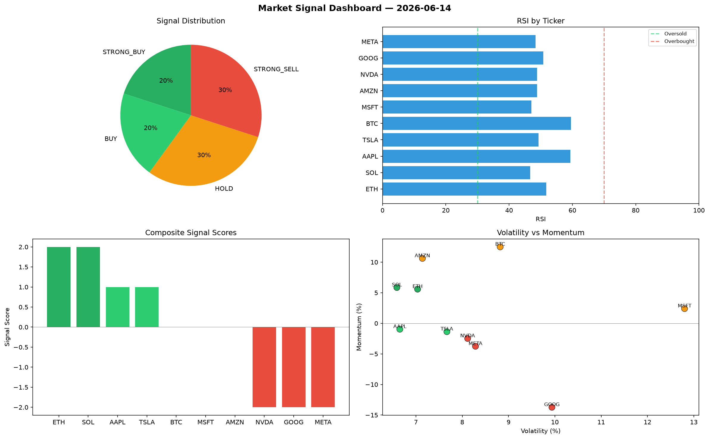

# Market Signal Report — 2026-06-14

**Run ID:** `f0db4a7cee` | **Buy:** 4 | **Sell:** 3 | **Hold:** 3

## Signal Dashboard

| Ticker | Price | Signal | Score | RSI | Momentum | Confidence |
|--------|-------|--------|-------|-----|----------|------------|
| ETH | $2043.59 | **STRONG_BUY** | 2 | 51.72 | 0.0558 | 0.5 |
| SOL | $335.44 | **STRONG_BUY** | 2 | 46.63 | 0.0585 | 0.5 |
| AAPL | $2432.5 | **BUY** | 1 | 59.39 | -0.0097 | 0.25 |
| TSLA | $3776.48 | **BUY** | 1 | 49.26 | -0.0137 | 0.25 |
| BTC | $194.77 | **HOLD** | 0 | 59.59 | 0.1249 | 0.0 |
| MSFT | $3889.29 | **HOLD** | 0 | 47.05 | 0.024 | 0.0 |
| AMZN | $3112.94 | **HOLD** | 0 | 48.88 | 0.1061 | 0.0 |
| NVDA | $2900.52 | **STRONG_SELL** | -2 | 48.88 | -0.0248 | 0.5 |
| GOOG | $4571.55 | **STRONG_SELL** | -2 | 50.81 | -0.1373 | 0.5 |
| META | $3250.02 | **STRONG_SELL** | -2 | 48.33 | -0.0376 | 0.5 |

## Delta vs Yesterday

| Ticker | Today | Yesterday | Price Change | Signal Changed |
|--------|-------|-----------|-------------|----------------|
| ETH | STRONG_BUY | STRONG_SELL | 📉 -55.1% | ⚠️ YES |
| SOL | STRONG_BUY | STRONG_BUY | 📉 -80.51% | — |
| AAPL | BUY | HOLD | 📈 186.78% | ⚠️ YES |
| TSLA | BUY | HOLD | 📉 -15.97% | ⚠️ YES |
| BTC | HOLD | SELL | 📉 -94.03% | ⚠️ YES |
| MSFT | HOLD | HOLD | 📉 -14.64% | — |
| AMZN | HOLD | STRONG_BUY | 📈 254.48% | ⚠️ YES |
| NVDA | STRONG_SELL | STRONG_SELL | 📈 445.97% | — |
| GOOG | STRONG_SELL | HOLD | 📈 18.13% | ⚠️ YES |
| META | STRONG_SELL | STRONG_BUY | 📉 -13.47% | ⚠️ YES |