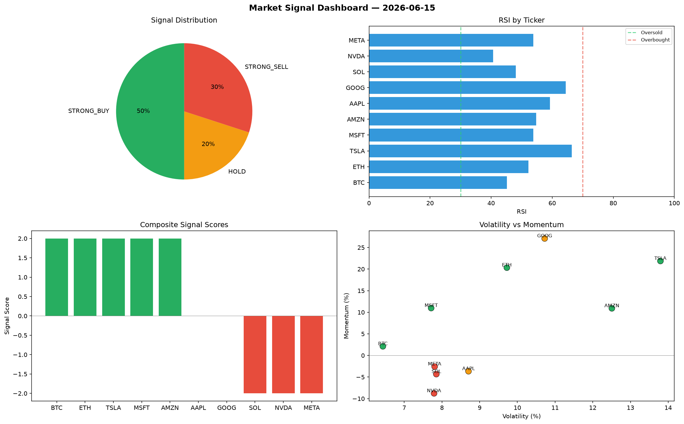

# Market Signal Report — 2026-06-15

**Run ID:** `131fabd266` | **Buy:** 5 | **Sell:** 3 | **Hold:** 2

## Signal Dashboard

| Ticker | Price | Signal | Score | RSI | Momentum | Confidence |
|--------|-------|--------|-------|-----|----------|------------|
| BTC | $3862.58 | **STRONG_BUY** | 2 | 45.2 | 0.0211 | 0.5 |
| ETH | $5168.23 | **STRONG_BUY** | 2 | 52.24 | 0.2033 | 0.5 |
| TSLA | $2796.21 | **STRONG_BUY** | 2 | 66.39 | 0.2187 | 0.5 |
| MSFT | $3218.35 | **STRONG_BUY** | 2 | 53.82 | 0.1097 | 0.5 |
| AMZN | $3215.26 | **STRONG_BUY** | 2 | 54.76 | 0.1091 | 0.5 |
| AAPL | $4047.9 | **HOLD** | 0 | 59.25 | -0.0366 | 0.0 |
| GOOG | $2432.43 | **HOLD** | 0 | 64.41 | 0.2709 | 0.0 |
| SOL | $2022.12 | **STRONG_SELL** | -2 | 48.06 | -0.0433 | 0.5 |
| NVDA | $2318.03 | **STRONG_SELL** | -2 | 40.65 | -0.0878 | 0.5 |
| META | $2657.68 | **STRONG_SELL** | -2 | 53.85 | -0.0258 | 0.5 |

## Delta vs Yesterday

| Ticker | Today | Yesterday | Price Change | Signal Changed |
|--------|-------|-----------|-------------|----------------|
| BTC | STRONG_BUY | HOLD | 📈 457.15% | ⚠️ YES |
| ETH | STRONG_BUY | STRONG_SELL | 📈 1598.96% | ⚠️ YES |
| TSLA | STRONG_BUY | SELL | 📈 897.04% | ⚠️ YES |
| MSFT | STRONG_BUY | HOLD | 📉 -17.75% | ⚠️ YES |
| AMZN | STRONG_BUY | HOLD | 📉 -24.53% | ⚠️ YES |
| AAPL | HOLD | STRONG_SELL | 📈 358.97% | ⚠️ YES |
| GOOG | HOLD | HOLD | 📈 101.83% | — |
| SOL | STRONG_SELL | STRONG_BUY | 📉 -36.57% | ⚠️ YES |
| NVDA | STRONG_SELL | HOLD | 📈 263.17% | ⚠️ YES |
| META | STRONG_SELL | STRONG_SELL | 📈 313.17% | — |