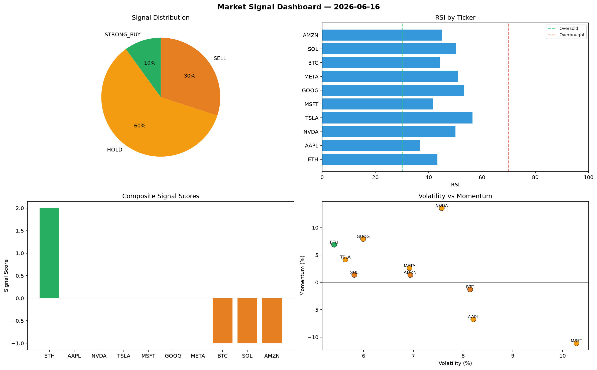

# Market Signal Report — 2026-06-16

**Run ID:** `726e80a995` | **Buy:** 1 | **Sell:** 3 | **Hold:** 6

## Signal Dashboard

| Ticker | Price | Signal | Score | RSI | Momentum | Confidence |
|--------|-------|--------|-------|-----|----------|------------|
| ETH | $4949.46 | **STRONG_BUY** | 2 | 43.32 | 0.0688 | 0.5 |
| AAPL | $3724.3 | **HOLD** | 0 | 36.63 | -0.0674 | 0.0 |
| NVDA | $5005.76 | **HOLD** | 0 | 50.03 | 0.1356 | 0.0 |
| TSLA | $1596.44 | **HOLD** | 0 | 56.47 | 0.0417 | 0.0 |
| MSFT | $2997.17 | **HOLD** | 0 | 41.64 | -0.1112 | 0.0 |
| GOOG | $4089.17 | **HOLD** | 0 | 53.34 | 0.0793 | 0.0 |
| META | $201.11 | **HOLD** | 0 | 51.08 | 0.026 | 0.0 |
| BTC | $2173.77 | **SELL** | -1 | 44.25 | -0.0128 | 0.25 |
| SOL | $4879.74 | **SELL** | -1 | 50.22 | 0.0137 | 0.25 |
| AMZN | $4229.09 | **SELL** | -1 | 44.92 | 0.0136 | 0.25 |

## Delta vs Yesterday

| Ticker | Today | Yesterday | Price Change | Signal Changed |
|--------|-------|-----------|-------------|----------------|
| ETH | STRONG_BUY | STRONG_BUY | 📈 2514.75% | — |
| AAPL | HOLD | STRONG_BUY | 📈 28.07% | ⚠️ YES |
| NVDA | HOLD | STRONG_BUY | 📈 10193.56% | ⚠️ YES |
| TSLA | HOLD | STRONG_SELL | 📉 -33.8% | ⚠️ YES |
| MSFT | HOLD | HOLD | 📈 582.0% | — |
| GOOG | HOLD | SELL | 📈 102.6% | ⚠️ YES |
| META | HOLD | BUY | 📉 -92.57% | ⚠️ YES |
| BTC | SELL | SELL | 📈 22.42% | — |
| SOL | SELL | STRONG_SELL | 📈 465.45% | ⚠️ YES |
| AMZN | SELL | BUY | 📈 21.96% | ⚠️ YES |