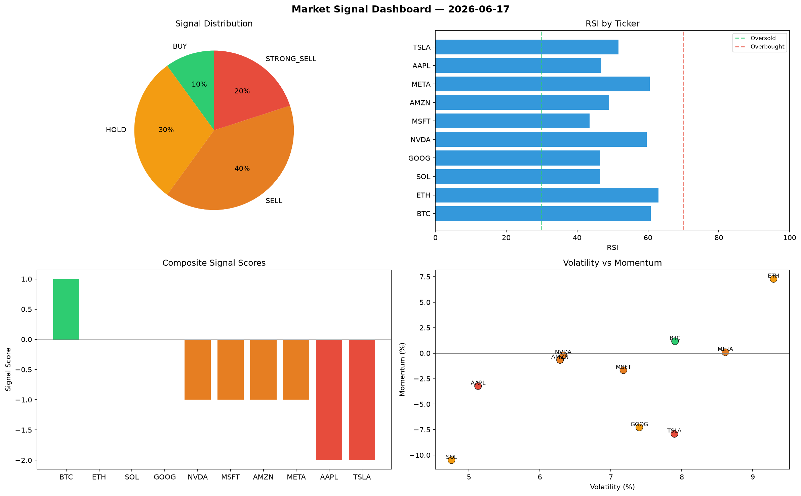

# Market Signal Report — 2026-06-17

**Run ID:** `b937a69c39` | **Buy:** 1 | **Sell:** 6 | **Hold:** 3

## Signal Dashboard

| Ticker | Price | Signal | Score | RSI | Momentum | Confidence |
|--------|-------|--------|-------|-----|----------|------------|
| BTC | $4277.85 | **BUY** | 1 | 60.79 | 0.0117 | 0.25 |
| ETH | $2484.52 | **HOLD** | 0 | 62.97 | 0.0728 | 0.0 |
| SOL | $669.88 | **HOLD** | 0 | 46.49 | -0.105 | 0.0 |
| GOOG | $3829.91 | **HOLD** | 0 | 46.43 | -0.0729 | 0.0 |
| NVDA | $4408.07 | **SELL** | -1 | 59.67 | -0.0021 | 0.25 |
| MSFT | $4768.04 | **SELL** | -1 | 43.56 | -0.0167 | 0.25 |
| AMZN | $3516.61 | **SELL** | -1 | 48.99 | -0.0067 | 0.25 |
| META | $4657.68 | **SELL** | -1 | 60.47 | 0.0009 | 0.25 |
| AAPL | $4721.51 | **STRONG_SELL** | -2 | 46.89 | -0.0323 | 0.5 |
| TSLA | $2560.3 | **STRONG_SELL** | -2 | 51.67 | -0.0792 | 0.5 |

## Delta vs Yesterday

| Ticker | Today | Yesterday | Price Change | Signal Changed |
|--------|-------|-----------|-------------|----------------|
| BTC | BUY | STRONG_BUY | 📈 139.22% | ⚠️ YES |
| ETH | HOLD | HOLD | 📉 -17.24% | — |
| SOL | HOLD | STRONG_SELL | 📉 -65.71% | ⚠️ YES |
| GOOG | HOLD | STRONG_BUY | 📉 -8.04% | ⚠️ YES |
| NVDA | SELL | BUY | 📈 32.7% | ⚠️ YES |
| MSFT | SELL | BUY | 📈 98.87% | ⚠️ YES |
| AMZN | SELL | STRONG_BUY | 📉 -25.77% | ⚠️ YES |
| META | SELL | STRONG_SELL | 📈 80.75% | ⚠️ YES |
| AAPL | STRONG_SELL | STRONG_SELL | 📈 63.48% | — |
| TSLA | STRONG_SELL | HOLD | 📈 383.69% | ⚠️ YES |