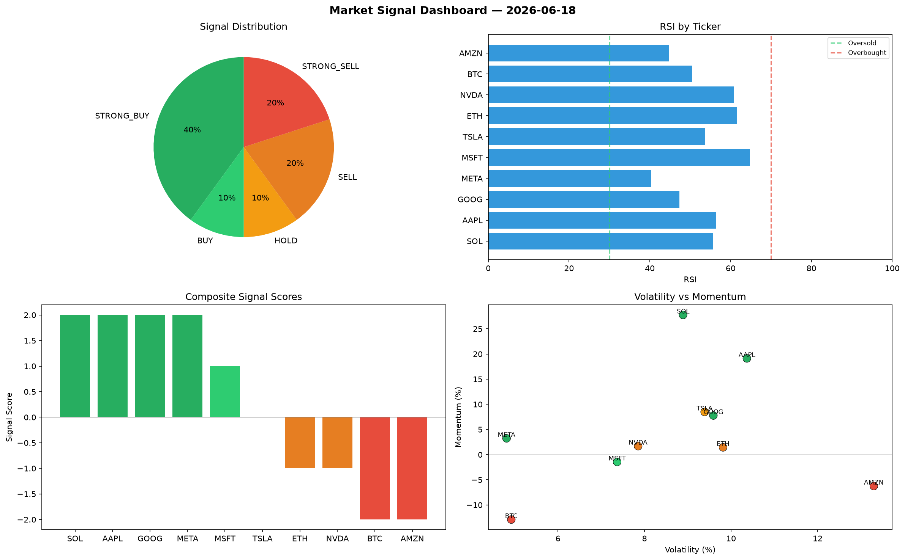

# Market Signal Report — 2026-06-18

**Run ID:** `776ceeef61` | **Buy:** 5 | **Sell:** 4 | **Hold:** 1

## Signal Dashboard

| Ticker | Price | Signal | Score | RSI | Momentum | Confidence |
|--------|-------|--------|-------|-----|----------|------------|
| SOL | $3204.12 | **STRONG_BUY** | 2 | 55.63 | 0.2776 | 0.5 |
| AAPL | $4755.89 | **STRONG_BUY** | 2 | 56.32 | 0.1913 | 0.5 |
| GOOG | $3566.87 | **STRONG_BUY** | 2 | 47.35 | 0.0778 | 0.5 |
| META | $3878.58 | **STRONG_BUY** | 2 | 40.24 | 0.0323 | 0.5 |
| MSFT | $3565.27 | **BUY** | 1 | 64.83 | -0.0145 | 0.25 |
| TSLA | $4365.85 | **HOLD** | 0 | 53.65 | 0.0849 | 0.0 |
| ETH | $499.04 | **SELL** | -1 | 61.53 | 0.0145 | 0.25 |
| NVDA | $3963.11 | **SELL** | -1 | 60.91 | 0.0169 | 0.25 |
| BTC | $23.69 | **STRONG_SELL** | -2 | 50.4 | -0.129 | 0.5 |
| AMZN | $1844.74 | **STRONG_SELL** | -2 | 44.68 | -0.0625 | 0.5 |

## Delta vs Yesterday

| Ticker | Today | Yesterday | Price Change | Signal Changed |
|--------|-------|-----------|-------------|----------------|
| SOL | STRONG_BUY | SELL | 📈 66.11% | ⚠️ YES |
| AAPL | STRONG_BUY | HOLD | 📈 19.63% | ⚠️ YES |
| GOOG | STRONG_BUY | BUY | 📈 192.76% | ⚠️ YES |
| META | STRONG_BUY | HOLD | 📈 72.47% | ⚠️ YES |
| MSFT | BUY | HOLD | 📈 87.64% | ⚠️ YES |
| TSLA | HOLD | STRONG_SELL | 📈 383.16% | ⚠️ YES |
| ETH | SELL | SELL | 📉 -71.31% | — |
| NVDA | SELL | STRONG_SELL | 📉 -14.82% | ⚠️ YES |
| BTC | STRONG_SELL | STRONG_BUY | 📉 -98.73% | ⚠️ YES |
| AMZN | STRONG_SELL | HOLD | 📈 65.69% | ⚠️ YES |