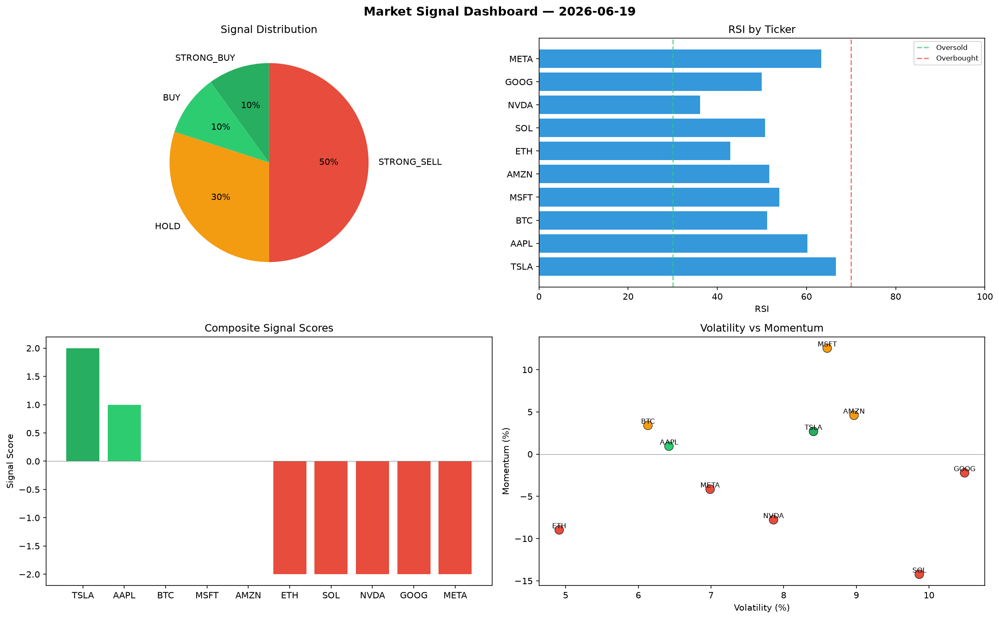

# Market Signal Report — 2026-06-19

**Run ID:** `3020c1e8b4` | **Buy:** 2 | **Sell:** 5 | **Hold:** 3

## Signal Dashboard

| Ticker | Price | Signal | Score | RSI | Momentum | Confidence |
|--------|-------|--------|-------|-----|----------|------------|
| TSLA | $3392.28 | **STRONG_BUY** | 2 | 66.64 | 0.0269 | 0.5 |
| AAPL | $4725.5 | **BUY** | 1 | 60.18 | 0.0094 | 0.25 |
| BTC | $2024.1 | **HOLD** | 0 | 51.18 | 0.0341 | 0.0 |
| MSFT | $4179.41 | **HOLD** | 0 | 53.95 | 0.1255 | 0.0 |
| AMZN | $700.38 | **HOLD** | 0 | 51.61 | 0.046 | 0.0 |
| ETH | $3891.79 | **STRONG_SELL** | -2 | 42.88 | -0.0897 | 0.5 |
| SOL | $3570.11 | **STRONG_SELL** | -2 | 50.74 | -0.1422 | 0.5 |
| NVDA | $4198.52 | **STRONG_SELL** | -2 | 36.1 | -0.0777 | 0.5 |
| GOOG | $1272.54 | **STRONG_SELL** | -2 | 49.93 | -0.0221 | 0.5 |
| META | $4158.39 | **STRONG_SELL** | -2 | 63.31 | -0.0415 | 0.5 |

## Delta vs Yesterday

| Ticker | Today | Yesterday | Price Change | Signal Changed |
|--------|-------|-----------|-------------|----------------|
| TSLA | STRONG_BUY | STRONG_SELL | 📈 50.04% | ⚠️ YES |
| AAPL | BUY | BUY | 📈 6.9% | — |
| BTC | HOLD | STRONG_SELL | 📈 1087.99% | ⚠️ YES |
| MSFT | HOLD | STRONG_BUY | 📈 384.09% | ⚠️ YES |
| AMZN | HOLD | HOLD | 📉 -58.6% | — |
| ETH | STRONG_SELL | HOLD | 📈 258.87% | ⚠️ YES |
| SOL | STRONG_SELL | HOLD | 📈 2007.63% | ⚠️ YES |
| NVDA | STRONG_SELL | STRONG_SELL | 📈 15.23% | — |
| GOOG | STRONG_SELL | BUY | 📉 -69.24% | ⚠️ YES |
| META | STRONG_SELL | SELL | 📈 268.68% | ⚠️ YES |