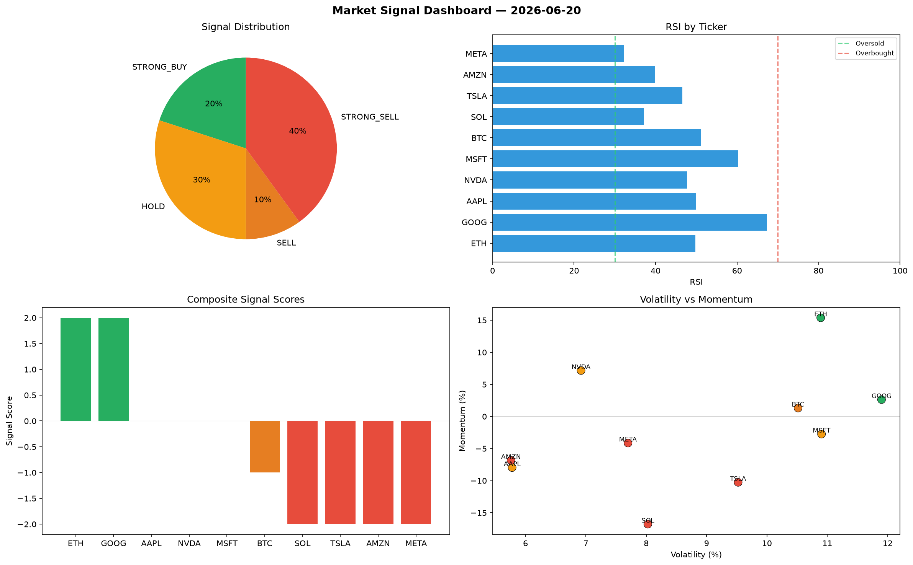

# Market Signal Report — 2026-06-20

**Run ID:** `402dc57223` | **Buy:** 2 | **Sell:** 5 | **Hold:** 3

## Signal Dashboard

| Ticker | Price | Signal | Score | RSI | Momentum | Confidence |
|--------|-------|--------|-------|-----|----------|------------|
| ETH | $3887.86 | **STRONG_BUY** | 2 | 49.73 | 0.1538 | 0.5 |
| GOOG | $3790.43 | **STRONG_BUY** | 2 | 67.31 | 0.0263 | 0.5 |
| AAPL | $4799.98 | **HOLD** | 0 | 49.92 | -0.0796 | 0.0 |
| NVDA | $5157.64 | **HOLD** | 0 | 47.7 | 0.0716 | 0.0 |
| MSFT | $4463.05 | **HOLD** | 0 | 60.17 | -0.0274 | 0.0 |
| BTC | $3616.7 | **SELL** | -1 | 51.08 | 0.0131 | 0.25 |
| SOL | $2066.2 | **STRONG_SELL** | -2 | 37.18 | -0.1678 | 0.5 |
| TSLA | $769.92 | **STRONG_SELL** | -2 | 46.6 | -0.1026 | 0.5 |
| AMZN | $3576.23 | **STRONG_SELL** | -2 | 39.78 | -0.0684 | 0.5 |
| META | $2781.41 | **STRONG_SELL** | -2 | 32.18 | -0.0414 | 0.5 |

## Delta vs Yesterday

| Ticker | Today | Yesterday | Price Change | Signal Changed |
|--------|-------|-----------|-------------|----------------|
| ETH | STRONG_BUY | STRONG_SELL | 📈 47.5% | ⚠️ YES |
| GOOG | STRONG_BUY | SELL | 📈 195.07% | ⚠️ YES |
| AAPL | HOLD | STRONG_BUY | 📈 43.71% | ⚠️ YES |
| NVDA | HOLD | STRONG_SELL | 📈 1441.53% | ⚠️ YES |
| MSFT | HOLD | STRONG_SELL | 📈 78.44% | ⚠️ YES |
| BTC | SELL | STRONG_BUY | 📉 -4.24% | ⚠️ YES |
| SOL | STRONG_SELL | STRONG_SELL | 📈 464.63% | — |
| TSLA | STRONG_SELL | STRONG_SELL | 📉 -53.96% | — |
| AMZN | STRONG_SELL | STRONG_BUY | 📈 2.9% | ⚠️ YES |
| META | STRONG_SELL | HOLD | 📉 -36.75% | ⚠️ YES |