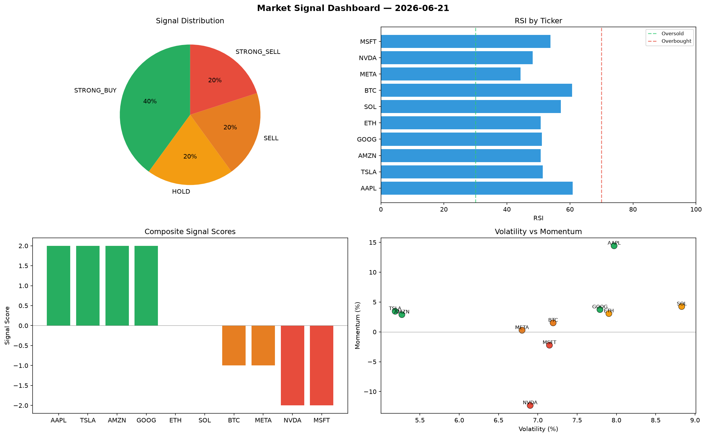

# Market Signal Report — 2026-06-21

**Run ID:** `99e29c4b66` | **Buy:** 4 | **Sell:** 4 | **Hold:** 2

## Signal Dashboard

| Ticker | Price | Signal | Score | RSI | Momentum | Confidence |
|--------|-------|--------|-------|-----|----------|------------|
| AAPL | $2208.09 | **STRONG_BUY** | 2 | 60.83 | 0.1442 | 0.5 |
| TSLA | $4911.44 | **STRONG_BUY** | 2 | 51.4 | 0.0345 | 0.5 |
| AMZN | $1261.04 | **STRONG_BUY** | 2 | 50.67 | 0.0289 | 0.5 |
| GOOG | $1802.09 | **STRONG_BUY** | 2 | 51.1 | 0.0374 | 0.5 |
| ETH | $1928.08 | **HOLD** | 0 | 50.7 | 0.0307 | 0.0 |
| SOL | $2246.39 | **HOLD** | 0 | 57.12 | 0.0425 | 0.0 |
| BTC | $3567.79 | **SELL** | -1 | 60.72 | 0.0151 | 0.25 |
| META | $2914.43 | **SELL** | -1 | 44.33 | 0.0027 | 0.25 |
| NVDA | $4530.47 | **STRONG_SELL** | -2 | 48.18 | -0.1232 | 0.5 |
| MSFT | $1090.55 | **STRONG_SELL** | -2 | 53.8 | -0.0223 | 0.5 |

## Delta vs Yesterday

| Ticker | Today | Yesterday | Price Change | Signal Changed |
|--------|-------|-----------|-------------|----------------|
| AAPL | STRONG_BUY | STRONG_BUY | 📉 -28.36% | — |
| TSLA | STRONG_BUY | HOLD | 📈 1032.29% | ⚠️ YES |
| AMZN | STRONG_BUY | BUY | 📉 -74.16% | ⚠️ YES |
| GOOG | STRONG_BUY | HOLD | 📉 -60.11% | ⚠️ YES |
| ETH | HOLD | STRONG_BUY | 📉 -63.56% | ⚠️ YES |
| SOL | HOLD | STRONG_BUY | 📉 -53.22% | ⚠️ YES |
| BTC | SELL | STRONG_SELL | 📈 1607.49% | ⚠️ YES |
| META | SELL | BUY | 📈 38.17% | ⚠️ YES |
| NVDA | STRONG_SELL | SELL | 📈 149.91% | ⚠️ YES |
| MSFT | STRONG_SELL | BUY | 📈 51.7% | ⚠️ YES |