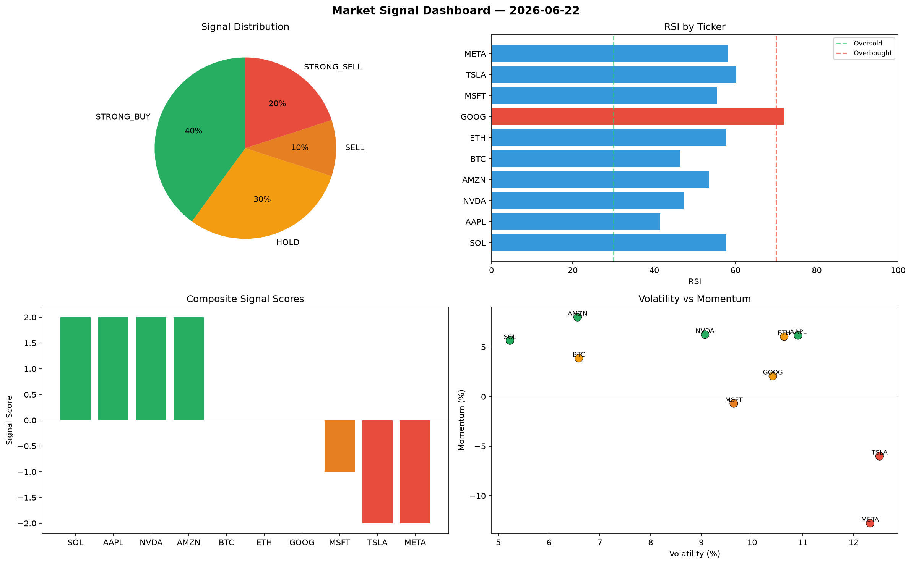

# Market Signal Report — 2026-06-22

**Run ID:** `9a70c1022e` | **Buy:** 4 | **Sell:** 3 | **Hold:** 3

## Signal Dashboard

| Ticker | Price | Signal | Score | RSI | Momentum | Confidence |
|--------|-------|--------|-------|-----|----------|------------|
| SOL | $4959.61 | **STRONG_BUY** | 2 | 57.76 | 0.0566 | 0.5 |
| AAPL | $3853.21 | **STRONG_BUY** | 2 | 41.5 | 0.0617 | 0.5 |
| NVDA | $1559.83 | **STRONG_BUY** | 2 | 47.26 | 0.0626 | 0.5 |
| AMZN | $2724.09 | **STRONG_BUY** | 2 | 53.52 | 0.0801 | 0.5 |
| BTC | $2461.41 | **HOLD** | 0 | 46.51 | 0.0387 | 0.0 |
| ETH | $547.8 | **HOLD** | 0 | 57.77 | 0.0606 | 0.0 |
| GOOG | $3670.1 | **HOLD** | 0 | 71.98 | 0.0208 | 0.0 |
| MSFT | $1314.81 | **SELL** | -1 | 55.39 | -0.0069 | 0.25 |
| TSLA | $2662.91 | **STRONG_SELL** | -2 | 60.07 | -0.0601 | 0.5 |
| META | $2168.15 | **STRONG_SELL** | -2 | 58.1 | -0.1277 | 0.5 |

## Delta vs Yesterday

| Ticker | Today | Yesterday | Price Change | Signal Changed |
|--------|-------|-----------|-------------|----------------|
| SOL | STRONG_BUY | STRONG_BUY | 📈 1141.73% | — |
| AAPL | STRONG_BUY | HOLD | 📈 957.93% | ⚠️ YES |
| NVDA | STRONG_BUY | HOLD | 📉 -66.97% | ⚠️ YES |
| AMZN | STRONG_BUY | STRONG_SELL | 📈 278.54% | ⚠️ YES |
| BTC | HOLD | STRONG_SELL | 📉 -45.47% | ⚠️ YES |
| ETH | HOLD | BUY | 📉 -24.11% | ⚠️ YES |
| GOOG | HOLD | STRONG_BUY | 📈 92.34% | ⚠️ YES |
| MSFT | SELL | STRONG_SELL | 📉 -19.25% | ⚠️ YES |
| TSLA | STRONG_SELL | STRONG_SELL | 📈 104.94% | — |
| META | STRONG_SELL | BUY | 📈 125.73% | ⚠️ YES |