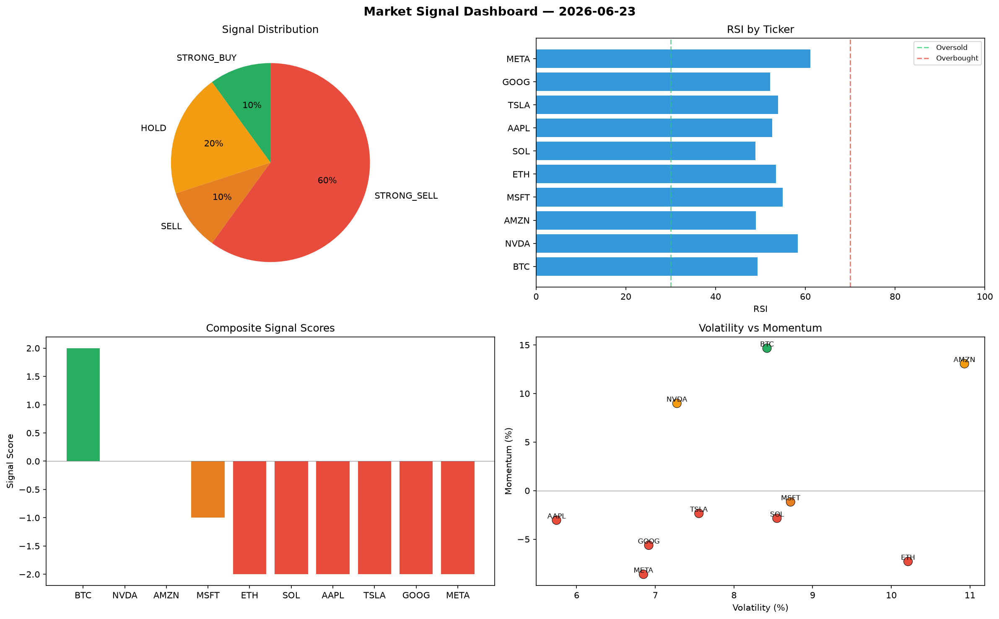

# Market Signal Report — 2026-06-23

**Run ID:** `4b5df81765` | **Buy:** 1 | **Sell:** 7 | **Hold:** 2

## Signal Dashboard

| Ticker | Price | Signal | Score | RSI | Momentum | Confidence |
|--------|-------|--------|-------|-----|----------|------------|
| BTC | $761.45 | **STRONG_BUY** | 2 | 49.33 | 0.1467 | 0.5 |
| NVDA | $1644.72 | **HOLD** | 0 | 58.31 | 0.0899 | 0.0 |
| AMZN | $320.65 | **HOLD** | 0 | 48.96 | 0.1307 | 0.0 |
| MSFT | $409.02 | **SELL** | -1 | 54.91 | -0.0116 | 0.25 |
| ETH | $1973.9 | **STRONG_SELL** | -2 | 53.42 | -0.0729 | 0.5 |
| SOL | $3759.67 | **STRONG_SELL** | -2 | 48.89 | -0.0284 | 0.5 |
| AAPL | $4795.91 | **STRONG_SELL** | -2 | 52.61 | -0.0304 | 0.5 |
| TSLA | $1251.51 | **STRONG_SELL** | -2 | 53.9 | -0.0234 | 0.5 |
| GOOG | $192.98 | **STRONG_SELL** | -2 | 52.1 | -0.0562 | 0.5 |
| META | $3385.23 | **STRONG_SELL** | -2 | 61.07 | -0.0861 | 0.5 |

## Delta vs Yesterday

| Ticker | Today | Yesterday | Price Change | Signal Changed |
|--------|-------|-----------|-------------|----------------|
| BTC | STRONG_BUY | STRONG_SELL | 📉 -76.06% | ⚠️ YES |
| NVDA | HOLD | STRONG_SELL | 📈 47.87% | ⚠️ YES |
| AMZN | HOLD | STRONG_BUY | 📉 -92.38% | ⚠️ YES |
| MSFT | SELL | STRONG_BUY | 📉 -86.58% | ⚠️ YES |
| ETH | STRONG_SELL | STRONG_SELL | 📉 -51.09% | — |
| SOL | STRONG_SELL | STRONG_SELL | 📈 200.62% | — |
| AAPL | STRONG_SELL | STRONG_BUY | 📈 94.61% | ⚠️ YES |
| TSLA | STRONG_SELL | STRONG_SELL | 📉 -66.37% | — |
| GOOG | STRONG_SELL | HOLD | 📉 -77.26% | ⚠️ YES |
| META | STRONG_SELL | SELL | 📉 -21.46% | ⚠️ YES |