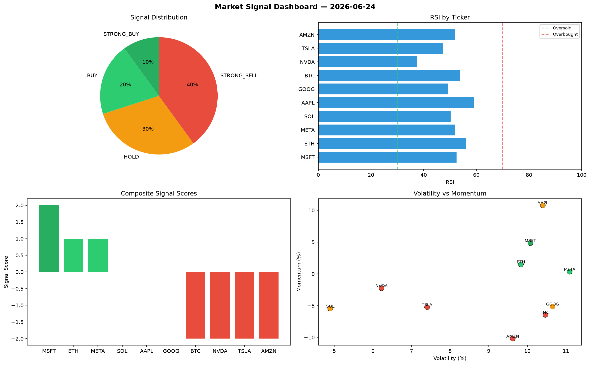

# Market Signal Report — 2026-06-24

**Run ID:** `50caf3b161` | **Buy:** 3 | **Sell:** 4 | **Hold:** 3

## Signal Dashboard

| Ticker | Price | Signal | Score | RSI | Momentum | Confidence |
|--------|-------|--------|-------|-----|----------|------------|
| MSFT | $4128.46 | **STRONG_BUY** | 2 | 52.52 | 0.0484 | 0.5 |
| ETH | $108.39 | **BUY** | 1 | 56.18 | 0.015 | 0.25 |
| META | $2481.27 | **BUY** | 1 | 51.9 | 0.0034 | 0.25 |
| SOL | $4726.47 | **HOLD** | 0 | 50.23 | -0.0547 | 0.0 |
| AAPL | $3136.94 | **HOLD** | 0 | 59.3 | 0.1079 | 0.0 |
| GOOG | $2527.62 | **HOLD** | 0 | 49.07 | -0.0514 | 0.0 |
| BTC | $1879.79 | **STRONG_SELL** | -2 | 53.74 | -0.0645 | 0.5 |
| NVDA | $4564.95 | **STRONG_SELL** | -2 | 37.54 | -0.0225 | 0.5 |
| TSLA | $2219.34 | **STRONG_SELL** | -2 | 47.32 | -0.0524 | 0.5 |
| AMZN | $2644.23 | **STRONG_SELL** | -2 | 52.01 | -0.1019 | 0.5 |

## Delta vs Yesterday

| Ticker | Today | Yesterday | Price Change | Signal Changed |
|--------|-------|-----------|-------------|----------------|
| MSFT | STRONG_BUY | STRONG_SELL | 📈 81.4% | ⚠️ YES |
| ETH | BUY | HOLD | 📉 -97.36% | ⚠️ YES |
| META | BUY | STRONG_BUY | 📉 -20.32% | ⚠️ YES |
| SOL | HOLD | STRONG_SELL | 📈 14.88% | ⚠️ YES |
| AAPL | HOLD | STRONG_BUY | 📈 639.36% | ⚠️ YES |
| GOOG | HOLD | STRONG_SELL | 📉 -22.94% | ⚠️ YES |
| BTC | STRONG_SELL | STRONG_SELL | 📉 -37.47% | — |
| NVDA | STRONG_SELL | BUY | 📈 28.61% | ⚠️ YES |
| TSLA | STRONG_SELL | BUY | 📉 -54.2% | ⚠️ YES |
| AMZN | STRONG_SELL | STRONG_SELL | 📉 -23.63% | — |