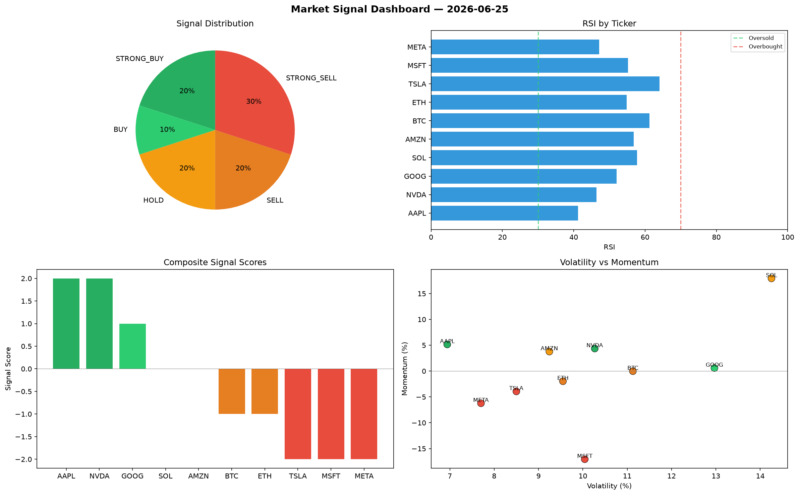

# Market Signal Report — 2026-06-25

**Run ID:** `a0819e8f38` | **Buy:** 3 | **Sell:** 5 | **Hold:** 2

## Signal Dashboard

| Ticker | Price | Signal | Score | RSI | Momentum | Confidence |
|--------|-------|--------|-------|-----|----------|------------|
| AAPL | $4886.65 | **STRONG_BUY** | 2 | 41.26 | 0.0515 | 0.5 |
| NVDA | $4332.14 | **STRONG_BUY** | 2 | 46.35 | 0.0436 | 0.5 |
| GOOG | $1421.7 | **BUY** | 1 | 52.05 | 0.0059 | 0.25 |
| SOL | $4440.95 | **HOLD** | 0 | 57.78 | 0.1793 | 0.0 |
| AMZN | $3588.66 | **HOLD** | 0 | 56.82 | 0.0377 | 0.0 |
| BTC | $3138.79 | **SELL** | -1 | 61.24 | -0.0002 | 0.25 |
| ETH | $2964.62 | **SELL** | -1 | 54.86 | -0.0197 | 0.25 |
| TSLA | $2688.35 | **STRONG_SELL** | -2 | 64.04 | -0.0394 | 0.5 |
| MSFT | $2561.28 | **STRONG_SELL** | -2 | 55.19 | -0.1706 | 0.5 |
| META | $2460.61 | **STRONG_SELL** | -2 | 47.12 | -0.0623 | 0.5 |

## Delta vs Yesterday

| Ticker | Today | Yesterday | Price Change | Signal Changed |
|--------|-------|-----------|-------------|----------------|
| AAPL | STRONG_BUY | HOLD | 📈 55.78% | ⚠️ YES |
| NVDA | STRONG_BUY | STRONG_SELL | 📉 -5.1% | ⚠️ YES |
| GOOG | BUY | HOLD | 📉 -43.75% | ⚠️ YES |
| SOL | HOLD | HOLD | 📉 -6.04% | — |
| AMZN | HOLD | STRONG_SELL | 📈 35.72% | ⚠️ YES |
| BTC | SELL | STRONG_SELL | 📈 66.98% | ⚠️ YES |
| ETH | SELL | BUY | 📈 2635.14% | ⚠️ YES |
| TSLA | STRONG_SELL | STRONG_SELL | 📈 21.13% | — |
| MSFT | STRONG_SELL | STRONG_BUY | 📉 -37.96% | ⚠️ YES |
| META | STRONG_SELL | BUY | 📉 -0.83% | ⚠️ YES |