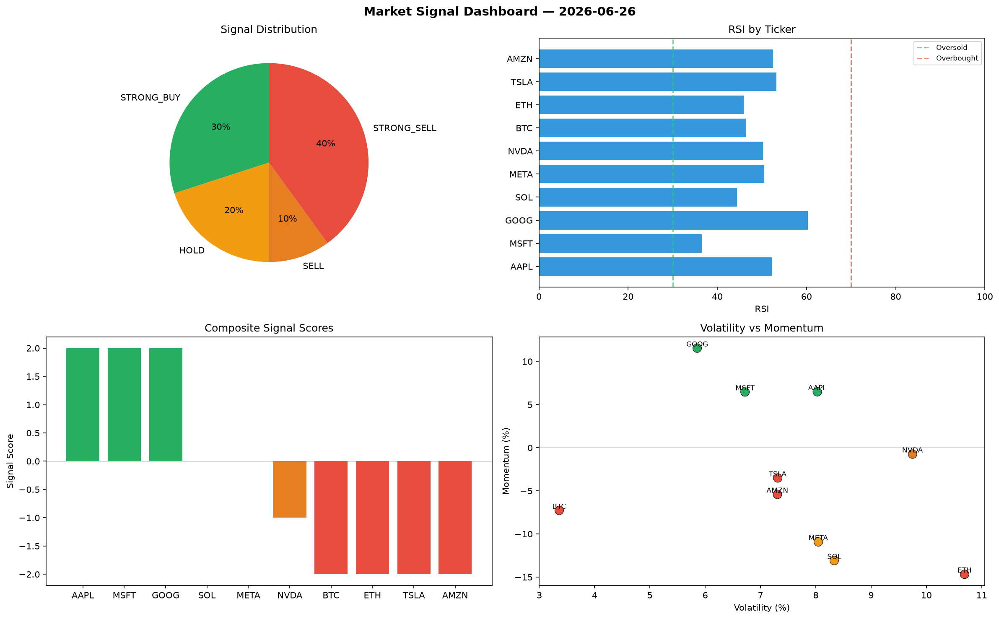

# Market Signal Report — 2026-06-26

**Run ID:** `d05c641d60` | **Buy:** 3 | **Sell:** 5 | **Hold:** 2

## Signal Dashboard

| Ticker | Price | Signal | Score | RSI | Momentum | Confidence |
|--------|-------|--------|-------|-----|----------|------------|
| AAPL | $3327.31 | **STRONG_BUY** | 2 | 52.19 | 0.0648 | 0.5 |
| MSFT | $1792.42 | **STRONG_BUY** | 2 | 36.55 | 0.0646 | 0.5 |
| GOOG | $2933.72 | **STRONG_BUY** | 2 | 60.35 | 0.1154 | 0.5 |
| SOL | $1363.57 | **HOLD** | 0 | 44.38 | -0.1308 | 0.0 |
| META | $2563.16 | **HOLD** | 0 | 50.52 | -0.1092 | 0.0 |
| NVDA | $3628.36 | **SELL** | -1 | 50.2 | -0.0074 | 0.25 |
| BTC | $1165.13 | **STRONG_SELL** | -2 | 46.52 | -0.0727 | 0.5 |
| ETH | $2291.8 | **STRONG_SELL** | -2 | 46.04 | -0.1467 | 0.5 |
| TSLA | $1472.45 | **STRONG_SELL** | -2 | 53.26 | -0.0351 | 0.5 |
| AMZN | $2296.39 | **STRONG_SELL** | -2 | 52.46 | -0.0541 | 0.5 |

## Delta vs Yesterday

| Ticker | Today | Yesterday | Price Change | Signal Changed |
|--------|-------|-----------|-------------|----------------|
| AAPL | STRONG_BUY | STRONG_SELL | 📉 -5.22% | ⚠️ YES |
| MSFT | STRONG_BUY | BUY | 📉 -59.44% | ⚠️ YES |
| GOOG | STRONG_BUY | HOLD | 📈 138.59% | ⚠️ YES |
| SOL | HOLD | STRONG_SELL | 📉 -63.53% | ⚠️ YES |
| META | HOLD | HOLD | 📉 -28.35% | — |
| NVDA | SELL | STRONG_SELL | 📈 71.09% | ⚠️ YES |
| BTC | STRONG_SELL | HOLD | 📉 -27.26% | ⚠️ YES |
| ETH | STRONG_SELL | STRONG_SELL | 📈 78.17% | — |
| TSLA | STRONG_SELL | STRONG_BUY | 📈 29.81% | ⚠️ YES |
| AMZN | STRONG_SELL | STRONG_BUY | 📈 458.94% | ⚠️ YES |