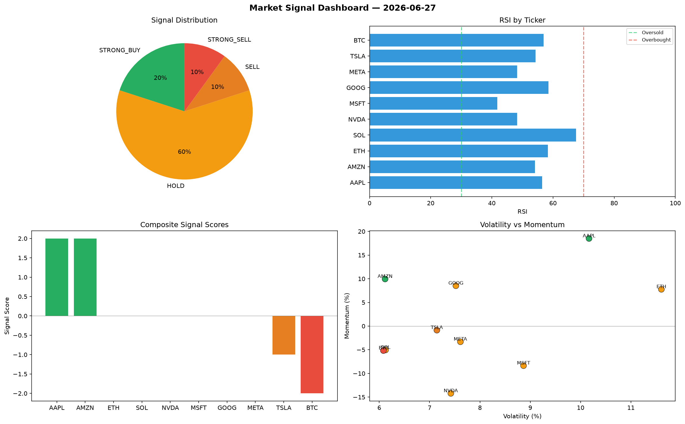

# Market Signal Report — 2026-06-27

**Run ID:** `6eceeb5231` | **Buy:** 2 | **Sell:** 2 | **Hold:** 6

## Signal Dashboard

| Ticker | Price | Signal | Score | RSI | Momentum | Confidence |
|--------|-------|--------|-------|-----|----------|------------|
| AAPL | $788.92 | **STRONG_BUY** | 2 | 56.46 | 0.1851 | 0.5 |
| AMZN | $1368.47 | **STRONG_BUY** | 2 | 54.08 | 0.0995 | 0.5 |
| ETH | $2448.83 | **HOLD** | 0 | 58.31 | 0.0777 | 0.0 |
| SOL | $2026.26 | **HOLD** | 0 | 67.57 | -0.0504 | 0.0 |
| NVDA | $4497.01 | **HOLD** | 0 | 48.25 | -0.1421 | 0.0 |
| MSFT | $696.51 | **HOLD** | 0 | 41.74 | -0.0836 | 0.0 |
| GOOG | $2844.57 | **HOLD** | 0 | 58.52 | 0.0852 | 0.0 |
| META | $4716.7 | **HOLD** | 0 | 48.26 | -0.0331 | 0.0 |
| TSLA | $3630.45 | **SELL** | -1 | 54.3 | -0.0086 | 0.25 |
| BTC | $4912.1 | **STRONG_SELL** | -2 | 56.95 | -0.0517 | 0.5 |

## Delta vs Yesterday

| Ticker | Today | Yesterday | Price Change | Signal Changed |
|--------|-------|-----------|-------------|----------------|
| AAPL | STRONG_BUY | STRONG_SELL | 📉 -59.55% | ⚠️ YES |
| AMZN | STRONG_BUY | HOLD | 📉 -30.28% | ⚠️ YES |
| ETH | HOLD | HOLD | 📉 -0.56% | — |
| SOL | HOLD | STRONG_BUY | 📉 -19.12% | ⚠️ YES |
| NVDA | HOLD | HOLD | 📈 6205.4% | — |
| MSFT | HOLD | STRONG_BUY | 📉 -85.67% | ⚠️ YES |
| GOOG | HOLD | STRONG_SELL | 📈 11.03% | ⚠️ YES |
| META | HOLD | HOLD | 📈 61.39% | — |
| TSLA | SELL | SELL | 📈 257.87% | — |
| BTC | STRONG_SELL | HOLD | 📈 21.61% | ⚠️ YES |