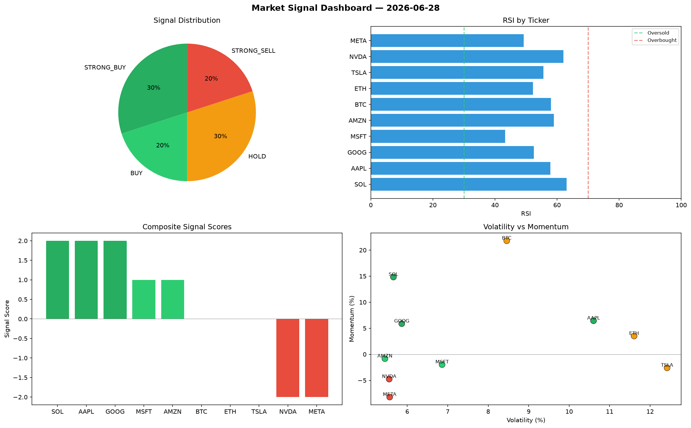

# Market Signal Report — 2026-06-28

**Run ID:** `5d1fcc67c5` | **Buy:** 5 | **Sell:** 2 | **Hold:** 3

## Signal Dashboard

| Ticker | Price | Signal | Score | RSI | Momentum | Confidence |
|--------|-------|--------|-------|-----|----------|------------|
| SOL | $513.49 | **STRONG_BUY** | 2 | 63.11 | 0.1483 | 0.5 |
| AAPL | $3749.14 | **STRONG_BUY** | 2 | 57.86 | 0.0644 | 0.5 |
| GOOG | $3725.52 | **STRONG_BUY** | 2 | 52.54 | 0.0588 | 0.5 |
| MSFT | $2854.08 | **BUY** | 1 | 43.27 | -0.0197 | 0.25 |
| AMZN | $1477.76 | **BUY** | 1 | 58.99 | -0.0083 | 0.25 |
| BTC | $2139.98 | **HOLD** | 0 | 58.01 | 0.218 | 0.0 |
| ETH | $3458.61 | **HOLD** | 0 | 52.23 | 0.0351 | 0.0 |
| TSLA | $2232.19 | **HOLD** | 0 | 55.64 | -0.026 | 0.0 |
| NVDA | $34.01 | **STRONG_SELL** | -2 | 62.09 | -0.0476 | 0.5 |
| META | $408.66 | **STRONG_SELL** | -2 | 49.29 | -0.0821 | 0.5 |

## Delta vs Yesterday

| Ticker | Today | Yesterday | Price Change | Signal Changed |
|--------|-------|-----------|-------------|----------------|
| SOL | STRONG_BUY | SELL | 📉 -81.05% | ⚠️ YES |
| AAPL | STRONG_BUY | SELL | 📈 23.28% | ⚠️ YES |
| GOOG | STRONG_BUY | STRONG_SELL | 📈 41.59% | ⚠️ YES |
| MSFT | BUY | STRONG_BUY | 📉 -33.55% | ⚠️ YES |
| AMZN | BUY | STRONG_SELL | 📉 -30.2% | ⚠️ YES |
| BTC | HOLD | STRONG_BUY | 📈 3.16% | ⚠️ YES |
| ETH | HOLD | BUY | 📈 259.95% | ⚠️ YES |
| TSLA | HOLD | HOLD | 📉 -33.64% | — |
| NVDA | STRONG_SELL | SELL | 📉 -99.2% | ⚠️ YES |
| META | STRONG_SELL | HOLD | 📈 172.93% | ⚠️ YES |