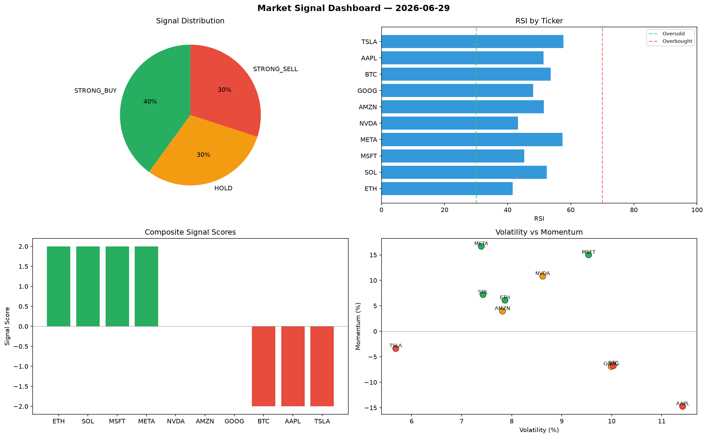

# Market Signal Report — 2026-06-29

**Run ID:** `ead1063c56` | **Buy:** 4 | **Sell:** 3 | **Hold:** 3

## Signal Dashboard

| Ticker | Price | Signal | Score | RSI | Momentum | Confidence |
|--------|-------|--------|-------|-----|----------|------------|
| ETH | $4574.05 | **STRONG_BUY** | 2 | 41.57 | 0.061 | 0.5 |
| SOL | $4640.66 | **STRONG_BUY** | 2 | 52.41 | 0.072 | 0.5 |
| MSFT | $5292.86 | **STRONG_BUY** | 2 | 45.27 | 0.1501 | 0.5 |
| META | $4184.0 | **STRONG_BUY** | 2 | 57.38 | 0.1668 | 0.5 |
| NVDA | $1560.17 | **HOLD** | 0 | 43.32 | 0.1082 | 0.0 |
| AMZN | $2151.65 | **HOLD** | 0 | 51.44 | 0.0396 | 0.0 |
| GOOG | $964.16 | **HOLD** | 0 | 48.07 | -0.0692 | 0.0 |
| BTC | $4487.42 | **STRONG_SELL** | -2 | 53.67 | -0.0674 | 0.5 |
| AAPL | $2922.19 | **STRONG_SELL** | -2 | 51.34 | -0.1473 | 0.5 |
| TSLA | $889.5 | **STRONG_SELL** | -2 | 57.68 | -0.0337 | 0.5 |

## Delta vs Yesterday

| Ticker | Today | Yesterday | Price Change | Signal Changed |
|--------|-------|-----------|-------------|----------------|
| ETH | STRONG_BUY | HOLD | 📈 14.34% | ⚠️ YES |
| SOL | STRONG_BUY | HOLD | 📈 201.96% | ⚠️ YES |
| MSFT | STRONG_BUY | STRONG_SELL | 📈 144.05% | ⚠️ YES |
| META | STRONG_BUY | STRONG_SELL | 📈 99.25% | ⚠️ YES |
| NVDA | HOLD | STRONG_SELL | 📉 -55.56% | ⚠️ YES |
| AMZN | HOLD | STRONG_SELL | 📉 -6.45% | ⚠️ YES |
| GOOG | HOLD | BUY | 📉 -71.75% | ⚠️ YES |
| BTC | STRONG_SELL | BUY | 📈 183.19% | ⚠️ YES |
| AAPL | STRONG_SELL | HOLD | 📈 644.51% | ⚠️ YES |
| TSLA | STRONG_SELL | STRONG_SELL | 📉 -31.44% | — |