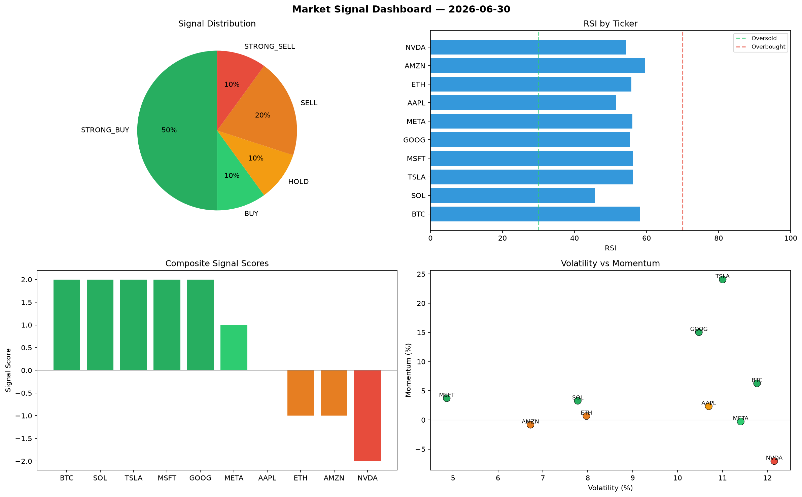

# Market Signal Report — 2026-06-30

**Run ID:** `74f3709daa` | **Buy:** 6 | **Sell:** 3 | **Hold:** 1

## Signal Dashboard

| Ticker | Price | Signal | Score | RSI | Momentum | Confidence |
|--------|-------|--------|-------|-----|----------|------------|
| BTC | $3089.19 | **STRONG_BUY** | 2 | 58.14 | 0.0627 | 0.5 |
| SOL | $856.01 | **STRONG_BUY** | 2 | 45.74 | 0.0328 | 0.5 |
| TSLA | $2465.36 | **STRONG_BUY** | 2 | 56.27 | 0.2406 | 0.5 |
| MSFT | $316.76 | **STRONG_BUY** | 2 | 56.24 | 0.0372 | 0.5 |
| GOOG | $2426.71 | **STRONG_BUY** | 2 | 55.4 | 0.1503 | 0.5 |
| META | $4726.02 | **BUY** | 1 | 56.03 | -0.0028 | 0.25 |
| AAPL | $118.5 | **HOLD** | 0 | 51.45 | 0.0234 | 0.0 |
| ETH | $1326.71 | **SELL** | -1 | 55.75 | 0.0067 | 0.25 |
| AMZN | $4134.62 | **SELL** | -1 | 59.61 | -0.0083 | 0.25 |
| NVDA | $2242.13 | **STRONG_SELL** | -2 | 54.39 | -0.0705 | 0.5 |

## Delta vs Yesterday

| Ticker | Today | Yesterday | Price Change | Signal Changed |
|--------|-------|-----------|-------------|----------------|
| BTC | STRONG_BUY | STRONG_BUY | 📈 47.84% | — |
| SOL | STRONG_BUY | STRONG_BUY | 📉 -57.51% | — |
| TSLA | STRONG_BUY | STRONG_BUY | 📉 -21.29% | — |
| MSFT | STRONG_BUY | BUY | 📉 -92.12% | ⚠️ YES |
| GOOG | STRONG_BUY | STRONG_SELL | 📉 -46.74% | ⚠️ YES |
| META | BUY | STRONG_SELL | 📈 63.9% | ⚠️ YES |
| AAPL | HOLD | HOLD | 📉 -97.22% | — |
| ETH | SELL | STRONG_BUY | 📉 -49.47% | ⚠️ YES |
| AMZN | SELL | HOLD | 📈 179.65% | ⚠️ YES |
| NVDA | STRONG_SELL | STRONG_BUY | 📉 -51.01% | ⚠️ YES |