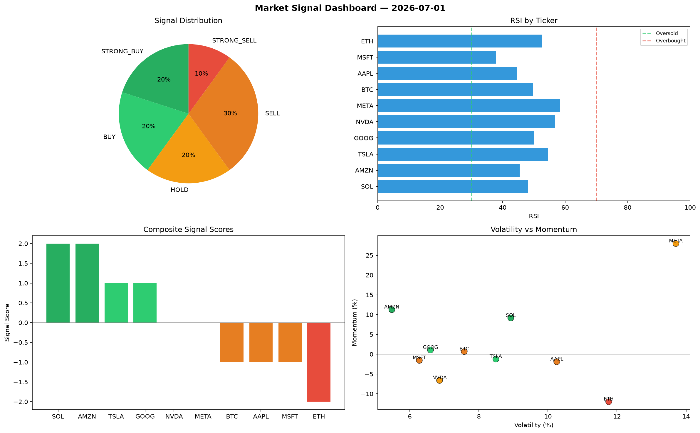

# Market Signal Report — 2026-07-01

**Run ID:** `a8243d00ab` | **Buy:** 4 | **Sell:** 4 | **Hold:** 2

## Signal Dashboard

| Ticker | Price | Signal | Score | RSI | Momentum | Confidence |
|--------|-------|--------|-------|-----|----------|------------|
| SOL | $2154.16 | **STRONG_BUY** | 2 | 48.06 | 0.0915 | 0.5 |
| AMZN | $4542.4 | **STRONG_BUY** | 2 | 45.46 | 0.1126 | 0.5 |
| TSLA | $4250.7 | **BUY** | 1 | 54.61 | -0.0126 | 0.25 |
| GOOG | $1081.72 | **BUY** | 1 | 50.15 | 0.0106 | 0.25 |
| NVDA | $1972.44 | **HOLD** | 0 | 56.83 | -0.0663 | 0.0 |
| META | $2187.22 | **HOLD** | 0 | 58.29 | 0.2797 | 0.0 |
| BTC | $64.15 | **SELL** | -1 | 49.71 | 0.0066 | 0.25 |
| AAPL | $4417.99 | **SELL** | -1 | 44.67 | -0.019 | 0.25 |
| MSFT | $2136.7 | **SELL** | -1 | 37.84 | -0.0156 | 0.25 |
| ETH | $1657.67 | **STRONG_SELL** | -2 | 52.7 | -0.1201 | 0.5 |

## Delta vs Yesterday

| Ticker | Today | Yesterday | Price Change | Signal Changed |
|--------|-------|-----------|-------------|----------------|
| SOL | STRONG_BUY | HOLD | 📉 -52.03% | ⚠️ YES |
| AMZN | STRONG_BUY | BUY | 📈 2.76% | ⚠️ YES |
| TSLA | BUY | STRONG_BUY | 📈 292.4% | ⚠️ YES |
| GOOG | BUY | STRONG_BUY | 📈 11.37% | ⚠️ YES |
| NVDA | HOLD | STRONG_SELL | 📉 -41.53% | ⚠️ YES |
| META | HOLD | HOLD | 📈 13.21% | — |
| BTC | SELL | HOLD | 📉 -70.97% | ⚠️ YES |
| AAPL | SELL | HOLD | 📈 60.95% | ⚠️ YES |
| MSFT | SELL | HOLD | 📈 110.44% | ⚠️ YES |
| ETH | STRONG_SELL | STRONG_SELL | 📉 -44.62% | — |