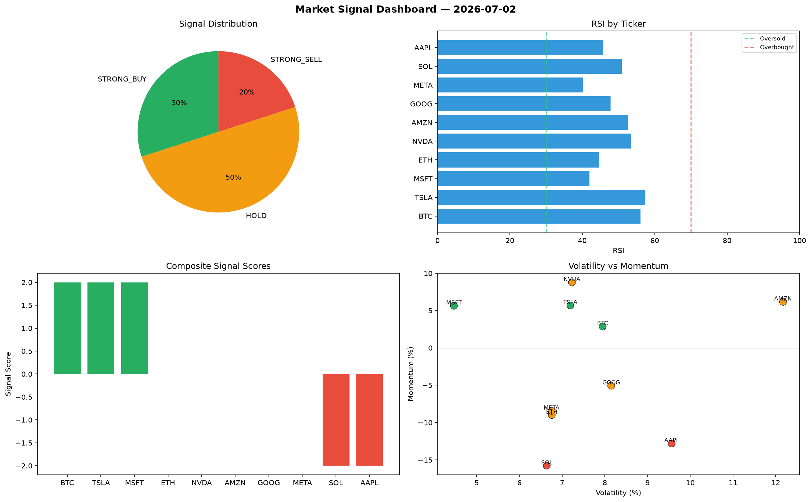

# Market Signal Report — 2026-07-02

**Run ID:** `7dce97f0eb` | **Buy:** 3 | **Sell:** 2 | **Hold:** 5

## Signal Dashboard

| Ticker | Price | Signal | Score | RSI | Momentum | Confidence |
|--------|-------|--------|-------|-----|----------|------------|
| BTC | $2206.58 | **STRONG_BUY** | 2 | 56.1 | 0.0287 | 0.5 |
| TSLA | $65.85 | **STRONG_BUY** | 2 | 57.33 | 0.0568 | 0.5 |
| MSFT | $3661.8 | **STRONG_BUY** | 2 | 41.96 | 0.0564 | 0.5 |
| ETH | $2220.97 | **HOLD** | 0 | 44.68 | -0.0899 | 0.0 |
| NVDA | $328.45 | **HOLD** | 0 | 53.45 | 0.0878 | 0.0 |
| AMZN | $559.79 | **HOLD** | 0 | 52.71 | 0.0617 | 0.0 |
| GOOG | $4482.66 | **HOLD** | 0 | 47.8 | -0.0506 | 0.0 |
| META | $1495.81 | **HOLD** | 0 | 40.16 | -0.0843 | 0.0 |
| SOL | $1851.1 | **STRONG_SELL** | -2 | 50.88 | -0.1578 | 0.5 |
| AAPL | $302.74 | **STRONG_SELL** | -2 | 45.74 | -0.1281 | 0.5 |

## Delta vs Yesterday

| Ticker | Today | Yesterday | Price Change | Signal Changed |
|--------|-------|-----------|-------------|----------------|
| BTC | STRONG_BUY | SELL | 📈 3339.72% | ⚠️ YES |
| TSLA | STRONG_BUY | BUY | 📉 -98.45% | ⚠️ YES |
| MSFT | STRONG_BUY | SELL | 📈 71.38% | ⚠️ YES |
| ETH | HOLD | STRONG_SELL | 📈 33.98% | ⚠️ YES |
| NVDA | HOLD | HOLD | 📉 -83.35% | — |
| AMZN | HOLD | STRONG_BUY | 📉 -87.68% | ⚠️ YES |
| GOOG | HOLD | BUY | 📈 314.4% | ⚠️ YES |
| META | HOLD | HOLD | 📉 -31.61% | — |
| SOL | STRONG_SELL | STRONG_BUY | 📉 -14.07% | ⚠️ YES |
| AAPL | STRONG_SELL | SELL | 📉 -93.15% | ⚠️ YES |