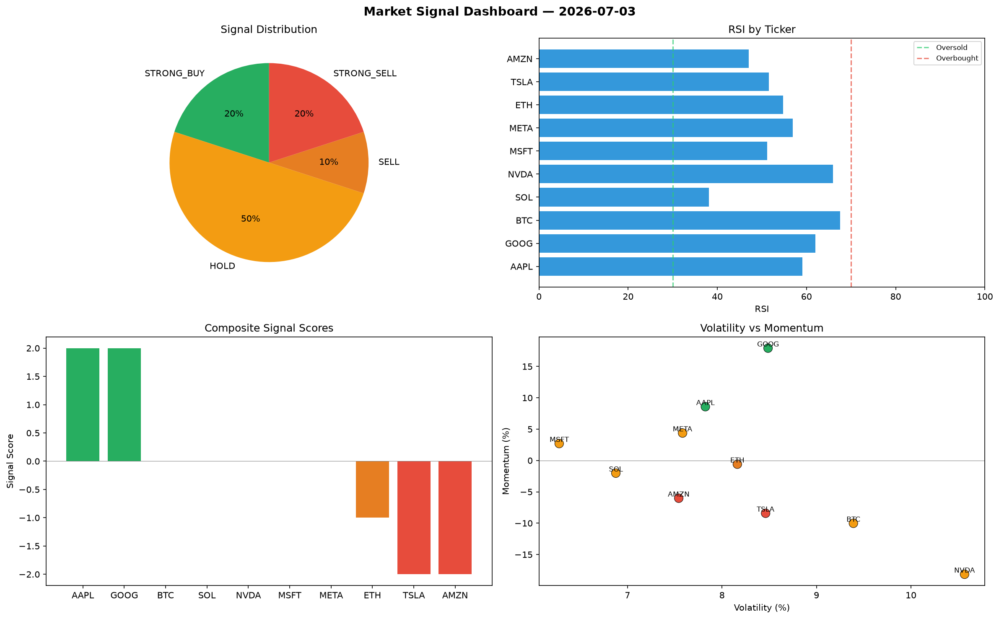

# Market Signal Report — 2026-07-03

**Run ID:** `0253f3b7fe` | **Buy:** 2 | **Sell:** 3 | **Hold:** 5

## Signal Dashboard

| Ticker | Price | Signal | Score | RSI | Momentum | Confidence |
|--------|-------|--------|-------|-----|----------|------------|
| AAPL | $3038.91 | **STRONG_BUY** | 2 | 59.05 | 0.0858 | 0.5 |
| GOOG | $3245.78 | **STRONG_BUY** | 2 | 62.02 | 0.1792 | 0.5 |
| BTC | $3382.92 | **HOLD** | 0 | 67.58 | -0.1002 | 0.0 |
| SOL | $1270.74 | **HOLD** | 0 | 38.16 | -0.0202 | 0.0 |
| NVDA | $2001.58 | **HOLD** | 0 | 65.92 | -0.1815 | 0.0 |
| MSFT | $2814.42 | **HOLD** | 0 | 51.16 | 0.027 | 0.0 |
| META | $1564.37 | **HOLD** | 0 | 56.9 | 0.0438 | 0.0 |
| ETH | $357.7 | **SELL** | -1 | 54.72 | -0.0059 | 0.25 |
| TSLA | $3003.45 | **STRONG_SELL** | -2 | 51.57 | -0.0842 | 0.5 |
| AMZN | $3266.18 | **STRONG_SELL** | -2 | 47.06 | -0.0602 | 0.5 |

## Delta vs Yesterday

| Ticker | Today | Yesterday | Price Change | Signal Changed |
|--------|-------|-----------|-------------|----------------|
| AAPL | STRONG_BUY | BUY | 📈 565.51% | ⚠️ YES |
| GOOG | STRONG_BUY | STRONG_SELL | 📉 -1.85% | ⚠️ YES |
| BTC | HOLD | STRONG_SELL | 📉 -23.4% | ⚠️ YES |
| SOL | HOLD | STRONG_SELL | 📉 -60.94% | ⚠️ YES |
| NVDA | HOLD | HOLD | 📉 -6.84% | — |
| MSFT | HOLD | BUY | 📉 -39.8% | ⚠️ YES |
| META | HOLD | HOLD | 📉 -22.56% | — |
| ETH | SELL | STRONG_BUY | 📉 -88.06% | ⚠️ YES |
| TSLA | STRONG_SELL | BUY | 📈 770.82% | ⚠️ YES |
| AMZN | STRONG_SELL | STRONG_BUY | 📉 -26.94% | ⚠️ YES |