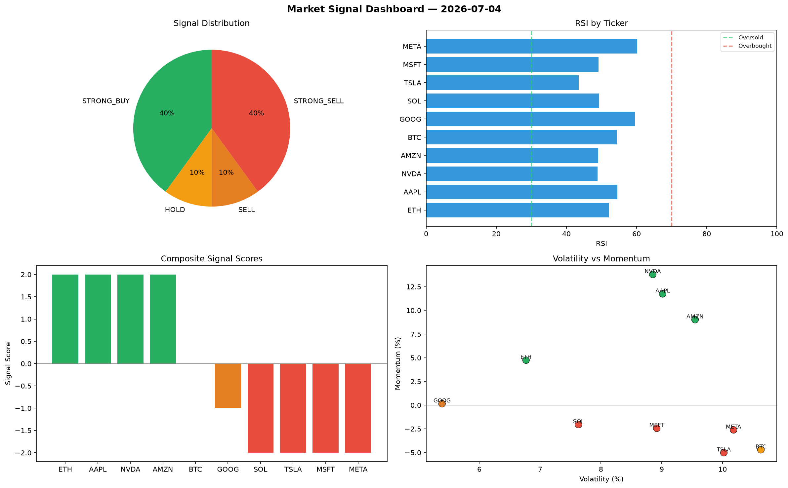

# Market Signal Report — 2026-07-04

**Run ID:** `3fa573f597` | **Buy:** 4 | **Sell:** 5 | **Hold:** 1

## Signal Dashboard

| Ticker | Price | Signal | Score | RSI | Momentum | Confidence |
|--------|-------|--------|-------|-----|----------|------------|
| ETH | $521.03 | **STRONG_BUY** | 2 | 52.13 | 0.0475 | 0.5 |
| AAPL | $1682.55 | **STRONG_BUY** | 2 | 54.5 | 0.1174 | 0.5 |
| NVDA | $5010.07 | **STRONG_BUY** | 2 | 48.85 | 0.1379 | 0.5 |
| AMZN | $914.54 | **STRONG_BUY** | 2 | 49.11 | 0.0902 | 0.5 |
| BTC | $932.77 | **HOLD** | 0 | 54.37 | -0.0471 | 0.0 |
| GOOG | $3047.48 | **SELL** | -1 | 59.57 | 0.0015 | 0.25 |
| SOL | $4803.14 | **STRONG_SELL** | -2 | 49.31 | -0.0205 | 0.5 |
| TSLA | $2362.14 | **STRONG_SELL** | -2 | 43.51 | -0.0502 | 0.5 |
| MSFT | $253.01 | **STRONG_SELL** | -2 | 49.16 | -0.0244 | 0.5 |
| META | $3452.2 | **STRONG_SELL** | -2 | 60.17 | -0.0261 | 0.5 |

## Delta vs Yesterday

| Ticker | Today | Yesterday | Price Change | Signal Changed |
|--------|-------|-----------|-------------|----------------|
| ETH | STRONG_BUY | STRONG_BUY | 📉 -81.89% | — |
| AAPL | STRONG_BUY | SELL | 📉 -1.9% | ⚠️ YES |
| NVDA | STRONG_BUY | SELL | 📈 107.02% | ⚠️ YES |
| AMZN | STRONG_BUY | STRONG_BUY | 📉 -58.94% | — |
| BTC | HOLD | STRONG_BUY | 📉 -20.42% | ⚠️ YES |
| GOOG | SELL | HOLD | 📈 264.18% | ⚠️ YES |
| SOL | STRONG_SELL | STRONG_BUY | 📈 336.22% | ⚠️ YES |
| TSLA | STRONG_SELL | STRONG_BUY | 📉 -48.56% | ⚠️ YES |
| MSFT | STRONG_SELL | SELL | 📉 -91.72% | ⚠️ YES |
| META | STRONG_SELL | HOLD | 📉 -34.25% | ⚠️ YES |