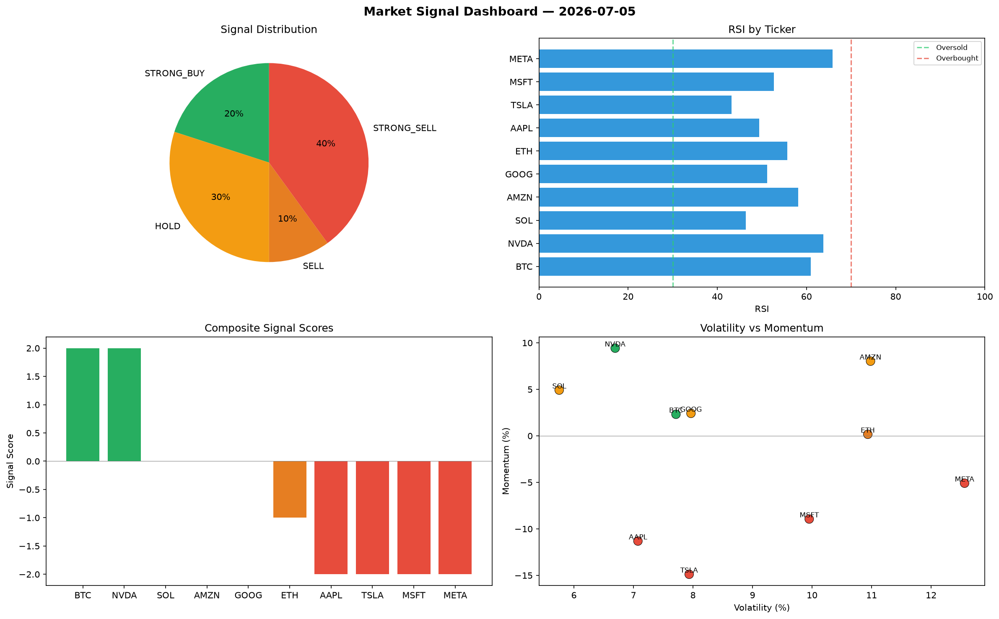

# Market Signal Report — 2026-07-05

**Run ID:** `3f57e8cc2c` | **Buy:** 2 | **Sell:** 5 | **Hold:** 3

## Signal Dashboard

| Ticker | Price | Signal | Score | RSI | Momentum | Confidence |
|--------|-------|--------|-------|-----|----------|------------|
| BTC | $692.58 | **STRONG_BUY** | 2 | 60.95 | 0.0232 | 0.5 |
| NVDA | $231.11 | **STRONG_BUY** | 2 | 63.75 | 0.0943 | 0.5 |
| SOL | $1077.23 | **HOLD** | 0 | 46.43 | 0.0492 | 0.0 |
| AMZN | $541.04 | **HOLD** | 0 | 58.12 | 0.0803 | 0.0 |
| GOOG | $873.58 | **HOLD** | 0 | 51.16 | 0.0242 | 0.0 |
| ETH | $1238.11 | **SELL** | -1 | 55.69 | 0.0017 | 0.25 |
| AAPL | $2699.54 | **STRONG_SELL** | -2 | 49.4 | -0.1131 | 0.5 |
| TSLA | $3966.46 | **STRONG_SELL** | -2 | 43.21 | -0.1488 | 0.5 |
| MSFT | $163.04 | **STRONG_SELL** | -2 | 52.67 | -0.0894 | 0.5 |
| META | $245.88 | **STRONG_SELL** | -2 | 65.86 | -0.0509 | 0.5 |

## Delta vs Yesterday

| Ticker | Today | Yesterday | Price Change | Signal Changed |
|--------|-------|-----------|-------------|----------------|
| BTC | STRONG_BUY | STRONG_SELL | 📉 -7.69% | ⚠️ YES |
| NVDA | STRONG_BUY | HOLD | 📉 -91.58% | ⚠️ YES |
| SOL | HOLD | BUY | 📈 165.26% | ⚠️ YES |
| AMZN | HOLD | HOLD | 📉 -87.46% | — |
| GOOG | HOLD | STRONG_BUY | 📈 6.55% | ⚠️ YES |
| ETH | SELL | HOLD | 📉 -2.99% | ⚠️ YES |
| AAPL | STRONG_SELL | HOLD | 📈 2585.31% | ⚠️ YES |
| TSLA | STRONG_SELL | STRONG_BUY | 📈 39.9% | ⚠️ YES |
| MSFT | STRONG_SELL | STRONG_SELL | 📉 -95.94% | — |
| META | STRONG_SELL | SELL | 📉 -73.4% | ⚠️ YES |