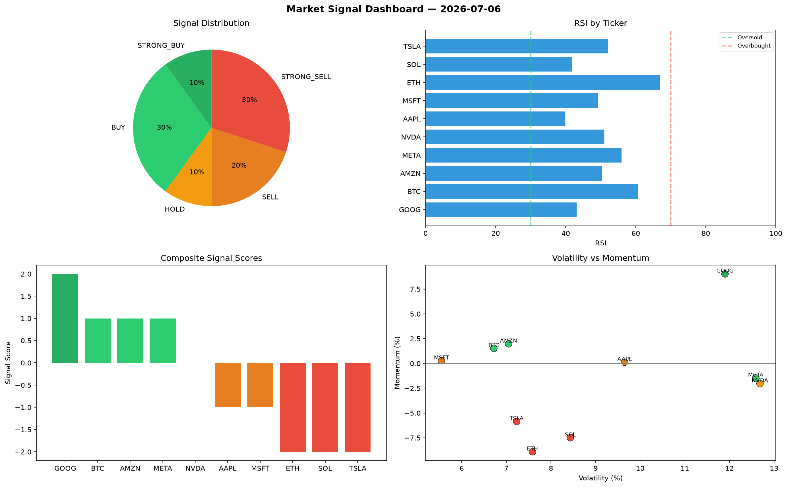

# Market Signal Report — 2026-07-06

**Run ID:** `2dd3ea0d46` | **Buy:** 4 | **Sell:** 5 | **Hold:** 1

## Signal Dashboard

| Ticker | Price | Signal | Score | RSI | Momentum | Confidence |
|--------|-------|--------|-------|-----|----------|------------|
| GOOG | $2496.42 | **STRONG_BUY** | 2 | 43.16 | 0.0903 | 0.5 |
| BTC | $1690.27 | **BUY** | 1 | 60.57 | 0.0152 | 0.25 |
| AMZN | $2358.31 | **BUY** | 1 | 50.34 | 0.0198 | 0.25 |
| META | $3024.29 | **BUY** | 1 | 55.99 | -0.0147 | 0.25 |
| NVDA | $138.35 | **HOLD** | 0 | 51.04 | -0.0203 | 0.0 |
| AAPL | $3640.43 | **SELL** | -1 | 39.9 | 0.0013 | 0.25 |
| MSFT | $4558.04 | **SELL** | -1 | 49.26 | 0.0027 | 0.25 |
| ETH | $3580.81 | **STRONG_SELL** | -2 | 66.96 | -0.0891 | 0.5 |
| SOL | $1621.97 | **STRONG_SELL** | -2 | 41.67 | -0.0749 | 0.5 |
| TSLA | $922.58 | **STRONG_SELL** | -2 | 52.22 | -0.0585 | 0.5 |

## Delta vs Yesterday

| Ticker | Today | Yesterday | Price Change | Signal Changed |
|--------|-------|-----------|-------------|----------------|
| GOOG | STRONG_BUY | HOLD | 📈 185.77% | ⚠️ YES |
| BTC | BUY | STRONG_BUY | 📈 144.05% | ⚠️ YES |
| AMZN | BUY | HOLD | 📈 335.88% | ⚠️ YES |
| META | BUY | STRONG_SELL | 📈 1129.99% | ⚠️ YES |
| NVDA | HOLD | STRONG_BUY | 📉 -40.14% | ⚠️ YES |
| AAPL | SELL | STRONG_SELL | 📈 34.85% | ⚠️ YES |
| MSFT | SELL | STRONG_SELL | 📈 2695.66% | ⚠️ YES |
| ETH | STRONG_SELL | SELL | 📈 189.22% | ⚠️ YES |
| SOL | STRONG_SELL | HOLD | 📈 50.57% | ⚠️ YES |
| TSLA | STRONG_SELL | STRONG_SELL | 📉 -76.74% | — |