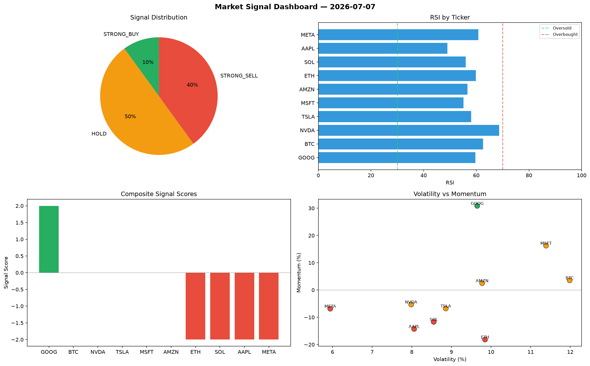

# Market Signal Report — 2026-07-07

**Run ID:** `10086dbf3c` | **Buy:** 1 | **Sell:** 4 | **Hold:** 5

## Signal Dashboard

| Ticker | Price | Signal | Score | RSI | Momentum | Confidence |
|--------|-------|--------|-------|-----|----------|------------|
| GOOG | $1866.64 | **STRONG_BUY** | 2 | 59.62 | 0.3087 | 0.5 |
| BTC | $4432.33 | **HOLD** | 0 | 62.52 | 0.0354 | 0.0 |
| NVDA | $1754.05 | **HOLD** | 0 | 68.63 | -0.0531 | 0.0 |
| TSLA | $3465.23 | **HOLD** | 0 | 58.09 | -0.0677 | 0.0 |
| MSFT | $3286.46 | **HOLD** | 0 | 55.17 | 0.1627 | 0.0 |
| AMZN | $3656.58 | **HOLD** | 0 | 56.68 | 0.0251 | 0.0 |
| ETH | $982.1 | **STRONG_SELL** | -2 | 59.84 | -0.1817 | 0.5 |
| SOL | $4613.46 | **STRONG_SELL** | -2 | 55.97 | -0.1169 | 0.5 |
| AAPL | $3760.25 | **STRONG_SELL** | -2 | 48.99 | -0.1427 | 0.5 |
| META | $323.89 | **STRONG_SELL** | -2 | 60.75 | -0.0685 | 0.5 |

## Delta vs Yesterday

| Ticker | Today | Yesterday | Price Change | Signal Changed |
|--------|-------|-----------|-------------|----------------|
| GOOG | STRONG_BUY | BUY | 📉 -55.87% | ⚠️ YES |
| BTC | HOLD | BUY | 📈 1171.36% | ⚠️ YES |
| NVDA | HOLD | STRONG_BUY | 📉 -42.85% | ⚠️ YES |
| TSLA | HOLD | HOLD | 📈 138.46% | — |
| MSFT | HOLD | STRONG_BUY | 📈 293.11% | ⚠️ YES |
| AMZN | HOLD | STRONG_SELL | 📈 451.32% | ⚠️ YES |
| ETH | STRONG_SELL | STRONG_BUY | 📉 -39.43% | ⚠️ YES |
| SOL | STRONG_SELL | STRONG_SELL | 📈 99.88% | — |
| AAPL | STRONG_SELL | STRONG_BUY | 📉 -6.21% | ⚠️ YES |
| META | STRONG_SELL | SELL | 📉 -57.91% | ⚠️ YES |