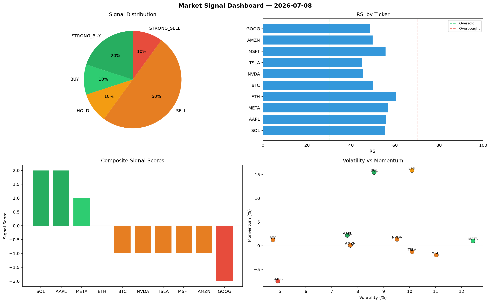

# Market Signal Report — 2026-07-08

**Run ID:** `cea9dc2d63` | **Buy:** 3 | **Sell:** 6 | **Hold:** 1

## Signal Dashboard

| Ticker | Price | Signal | Score | RSI | Momentum | Confidence |
|--------|-------|--------|-------|-----|----------|------------|
| SOL | $214.98 | **STRONG_BUY** | 2 | 55.28 | 0.1546 | 0.5 |
| AAPL | $2454.62 | **STRONG_BUY** | 2 | 55.92 | 0.0218 | 0.5 |
| META | $3190.94 | **BUY** | 1 | 56.75 | 0.0101 | 0.25 |
| ETH | $4140.22 | **HOLD** | 0 | 60.43 | 0.1587 | 0.0 |
| BTC | $210.6 | **SELL** | -1 | 49.89 | 0.0125 | 0.25 |
| NVDA | $1631.15 | **SELL** | -1 | 45.56 | 0.0135 | 0.25 |
| TSLA | $878.07 | **SELL** | -1 | 44.83 | -0.0126 | 0.25 |
| MSFT | $3341.48 | **SELL** | -1 | 55.68 | -0.0196 | 0.25 |
| AMZN | $1285.89 | **SELL** | -1 | 49.77 | 0.0008 | 0.25 |
| GOOG | $2206.99 | **STRONG_SELL** | -2 | 48.76 | -0.0746 | 0.5 |

## Delta vs Yesterday

| Ticker | Today | Yesterday | Price Change | Signal Changed |
|--------|-------|-----------|-------------|----------------|
| SOL | STRONG_BUY | SELL | 📉 -86.49% | ⚠️ YES |
| AAPL | STRONG_BUY | STRONG_BUY | 📉 -24.81% | — |
| META | BUY | STRONG_BUY | 📉 -16.93% | ⚠️ YES |
| ETH | HOLD | HOLD | 📉 -1.03% | — |
| BTC | SELL | STRONG_BUY | 📉 -94.98% | ⚠️ YES |
| NVDA | SELL | HOLD | 📈 57.97% | ⚠️ YES |
| TSLA | SELL | BUY | 📉 -76.17% | ⚠️ YES |
| MSFT | SELL | HOLD | 📉 -8.87% | ⚠️ YES |
| AMZN | SELL | STRONG_BUY | 📉 -47.81% | ⚠️ YES |
| GOOG | STRONG_SELL | HOLD | 📈 84.87% | ⚠️ YES |