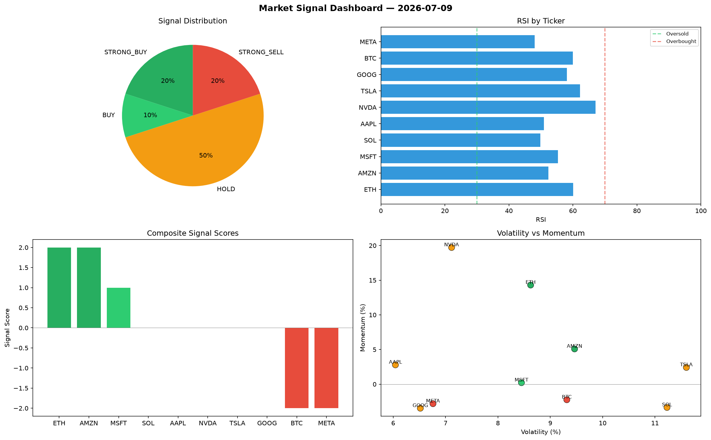

# Market Signal Report — 2026-07-09

**Run ID:** `ffe075ddbc` | **Buy:** 3 | **Sell:** 2 | **Hold:** 5

## Signal Dashboard

| Ticker | Price | Signal | Score | RSI | Momentum | Confidence |
|--------|-------|--------|-------|-----|----------|------------|
| ETH | $808.55 | **STRONG_BUY** | 2 | 60.06 | 0.143 | 0.5 |
| AMZN | $272.21 | **STRONG_BUY** | 2 | 52.32 | 0.0509 | 0.5 |
| MSFT | $3624.37 | **BUY** | 1 | 55.34 | 0.0022 | 0.25 |
| SOL | $2281.66 | **HOLD** | 0 | 49.82 | -0.0335 | 0.0 |
| AAPL | $1752.92 | **HOLD** | 0 | 50.94 | 0.0279 | 0.0 |
| NVDA | $413.83 | **HOLD** | 0 | 67.08 | 0.1972 | 0.0 |
| TSLA | $861.3 | **HOLD** | 0 | 62.22 | 0.0242 | 0.0 |
| GOOG | $2470.43 | **HOLD** | 0 | 58.11 | -0.0346 | 0.0 |
| BTC | $4922.55 | **STRONG_SELL** | -2 | 59.96 | -0.0224 | 0.5 |
| META | $1605.65 | **STRONG_SELL** | -2 | 48.09 | -0.0281 | 0.5 |

## Delta vs Yesterday

| Ticker | Today | Yesterday | Price Change | Signal Changed |
|--------|-------|-----------|-------------|----------------|
| ETH | STRONG_BUY | STRONG_SELL | 📉 -38.95% | ⚠️ YES |
| AMZN | STRONG_BUY | STRONG_BUY | 📉 -93.84% | — |
| MSFT | BUY | HOLD | 📉 -26.41% | ⚠️ YES |
| SOL | HOLD | STRONG_BUY | 📉 -46.67% | ⚠️ YES |
| AAPL | HOLD | STRONG_SELL | 📉 -13.21% | ⚠️ YES |
| NVDA | HOLD | HOLD | 📉 -90.23% | — |
| TSLA | HOLD | STRONG_BUY | 📉 -54.41% | ⚠️ YES |
| GOOG | HOLD | HOLD | 📈 350.78% | — |
| BTC | STRONG_SELL | HOLD | 📈 73.16% | ⚠️ YES |
| META | STRONG_SELL | SELL | 📉 -33.3% | ⚠️ YES |