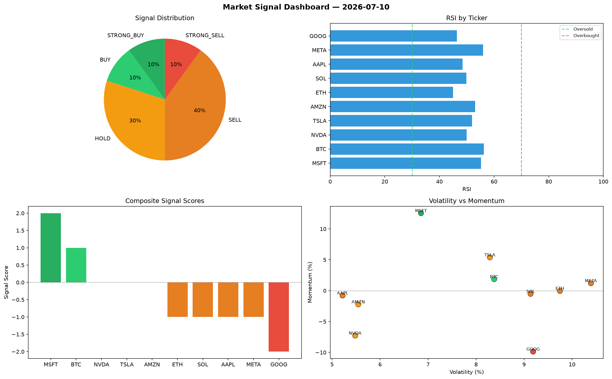

# Market Signal Report — 2026-07-10

**Run ID:** `885942968e` | **Buy:** 2 | **Sell:** 5 | **Hold:** 3

## Signal Dashboard

| Ticker | Price | Signal | Score | RSI | Momentum | Confidence |
|--------|-------|--------|-------|-----|----------|------------|
| MSFT | $5053.96 | **STRONG_BUY** | 2 | 55.25 | 0.1255 | 0.5 |
| BTC | $1059.18 | **BUY** | 1 | 56.23 | 0.0186 | 0.25 |
| NVDA | $4061.08 | **HOLD** | 0 | 49.95 | -0.0728 | 0.0 |
| TSLA | $3846.4 | **HOLD** | 0 | 51.93 | 0.0539 | 0.0 |
| AMZN | $212.75 | **HOLD** | 0 | 53.1 | -0.0222 | 0.0 |
| ETH | $3428.03 | **SELL** | -1 | 45.02 | -0.0005 | 0.25 |
| SOL | $2494.16 | **SELL** | -1 | 49.9 | -0.0052 | 0.25 |
| AAPL | $2056.61 | **SELL** | -1 | 48.46 | -0.0079 | 0.25 |
| META | $3920.32 | **SELL** | -1 | 55.96 | 0.012 | 0.25 |
| GOOG | $3179.25 | **STRONG_SELL** | -2 | 46.4 | -0.0987 | 0.5 |

## Delta vs Yesterday

| Ticker | Today | Yesterday | Price Change | Signal Changed |
|--------|-------|-----------|-------------|----------------|
| MSFT | STRONG_BUY | STRONG_SELL | 📈 111.76% | ⚠️ YES |
| BTC | BUY | SELL | 📉 -77.88% | ⚠️ YES |
| NVDA | HOLD | STRONG_BUY | 📈 2499.42% | ⚠️ YES |
| TSLA | HOLD | STRONG_SELL | 📈 41.2% | ⚠️ YES |
| AMZN | HOLD | HOLD | 📉 -92.55% | — |
| ETH | SELL | STRONG_SELL | 📈 82.88% | ⚠️ YES |
| SOL | SELL | STRONG_BUY | 📈 10.11% | ⚠️ YES |
| AAPL | SELL | STRONG_BUY | 📈 47.64% | ⚠️ YES |
| META | SELL | HOLD | 📈 173.75% | ⚠️ YES |
| GOOG | STRONG_SELL | STRONG_BUY | 📉 -40.37% | ⚠️ YES |