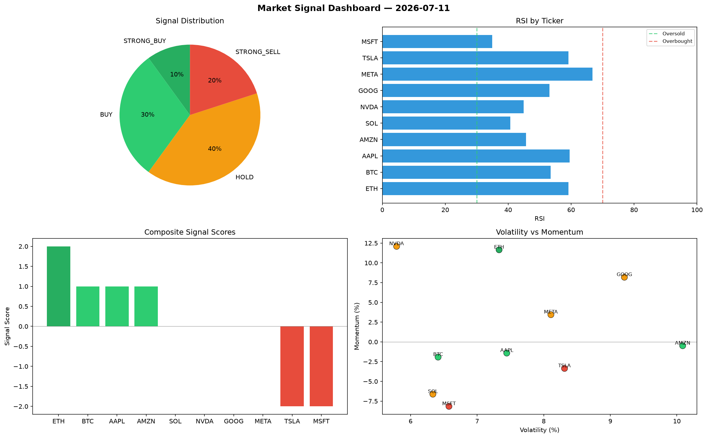

# Market Signal Report — 2026-07-11

**Run ID:** `b0345a8adc` | **Buy:** 4 | **Sell:** 2 | **Hold:** 4

## Signal Dashboard

| Ticker | Price | Signal | Score | RSI | Momentum | Confidence |
|--------|-------|--------|-------|-----|----------|------------|
| ETH | $3303.27 | **STRONG_BUY** | 2 | 59.18 | 0.1165 | 0.5 |
| BTC | $4358.53 | **BUY** | 1 | 53.51 | -0.0193 | 0.25 |
| AAPL | $3582.77 | **BUY** | 1 | 59.55 | -0.0142 | 0.25 |
| AMZN | $3967.95 | **BUY** | 1 | 45.68 | -0.0049 | 0.25 |
| SOL | $4413.06 | **HOLD** | 0 | 40.71 | -0.0662 | 0.0 |
| NVDA | $4249.02 | **HOLD** | 0 | 44.91 | 0.1209 | 0.0 |
| GOOG | $2777.62 | **HOLD** | 0 | 53.14 | 0.0818 | 0.0 |
| META | $2453.18 | **HOLD** | 0 | 66.81 | 0.0344 | 0.0 |
| TSLA | $3163.83 | **STRONG_SELL** | -2 | 59.13 | -0.0336 | 0.5 |
| MSFT | $946.15 | **STRONG_SELL** | -2 | 34.89 | -0.0816 | 0.5 |

## Delta vs Yesterday

| Ticker | Today | Yesterday | Price Change | Signal Changed |
|--------|-------|-----------|-------------|----------------|
| ETH | STRONG_BUY | STRONG_BUY | 📈 18.11% | — |
| BTC | BUY | STRONG_SELL | 📉 -3.25% | ⚠️ YES |
| AAPL | BUY | STRONG_SELL | 📈 491.17% | ⚠️ YES |
| AMZN | BUY | HOLD | 📈 368.34% | ⚠️ YES |
| SOL | HOLD | STRONG_BUY | 📈 44.69% | ⚠️ YES |
| NVDA | HOLD | STRONG_SELL | 📈 26.84% | ⚠️ YES |
| GOOG | HOLD | BUY | 📈 18.92% | ⚠️ YES |
| META | HOLD | HOLD | 📉 -42.56% | — |
| TSLA | STRONG_SELL | HOLD | 📈 4.03% | ⚠️ YES |
| MSFT | STRONG_SELL | HOLD | 📉 -44.53% | ⚠️ YES |