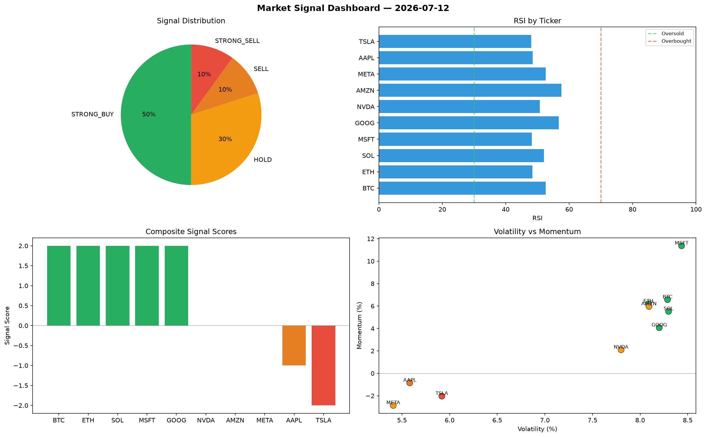

# Market Signal Report — 2026-07-12

**Run ID:** `4f6d5955cc` | **Buy:** 5 | **Sell:** 2 | **Hold:** 3

## Signal Dashboard

| Ticker | Price | Signal | Score | RSI | Momentum | Confidence |
|--------|-------|--------|-------|-----|----------|------------|
| BTC | $3506.8 | **STRONG_BUY** | 2 | 52.62 | 0.0657 | 0.5 |
| ETH | $4846.48 | **STRONG_BUY** | 2 | 48.38 | 0.062 | 0.5 |
| SOL | $1303.7 | **STRONG_BUY** | 2 | 52.08 | 0.0552 | 0.5 |
| MSFT | $2283.05 | **STRONG_BUY** | 2 | 48.26 | 0.1137 | 0.5 |
| GOOG | $3656.79 | **STRONG_BUY** | 2 | 56.74 | 0.0407 | 0.5 |
| NVDA | $2860.89 | **HOLD** | 0 | 50.7 | 0.021 | 0.0 |
| AMZN | $3339.19 | **HOLD** | 0 | 57.58 | 0.0596 | 0.0 |
| META | $4694.09 | **HOLD** | 0 | 52.57 | -0.0286 | 0.0 |
| AAPL | $3292.82 | **SELL** | -1 | 48.49 | -0.0085 | 0.25 |
| TSLA | $4739.67 | **STRONG_SELL** | -2 | 48.06 | -0.0203 | 0.5 |

## Delta vs Yesterday

| Ticker | Today | Yesterday | Price Change | Signal Changed |
|--------|-------|-----------|-------------|----------------|
| BTC | STRONG_BUY | HOLD | 📈 2291.6% | ⚠️ YES |
| ETH | STRONG_BUY | STRONG_SELL | 📈 146.98% | ⚠️ YES |
| SOL | STRONG_BUY | STRONG_BUY | 📉 -72.8% | — |
| MSFT | STRONG_BUY | BUY | 📈 90.19% | ⚠️ YES |
| GOOG | STRONG_BUY | HOLD | 📈 36.44% | ⚠️ YES |
| NVDA | HOLD | STRONG_SELL | 📉 -32.0% | ⚠️ YES |
| AMZN | HOLD | HOLD | 📈 12.98% | — |
| META | HOLD | STRONG_SELL | 📈 189.54% | ⚠️ YES |
| AAPL | SELL | STRONG_SELL | 📉 -18.71% | ⚠️ YES |
| TSLA | STRONG_SELL | STRONG_BUY | 📈 381.44% | ⚠️ YES |