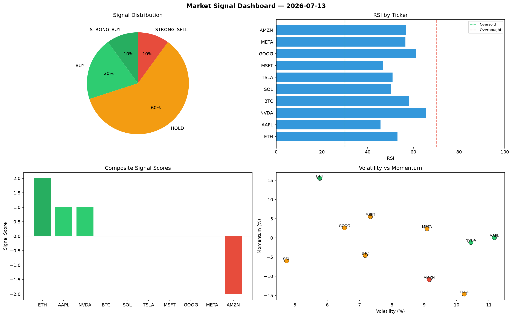

# Market Signal Report — 2026-07-13

**Run ID:** `b5183b4301` | **Buy:** 3 | **Sell:** 1 | **Hold:** 6

## Signal Dashboard

| Ticker | Price | Signal | Score | RSI | Momentum | Confidence |
|--------|-------|--------|-------|-----|----------|------------|
| ETH | $3719.87 | **STRONG_BUY** | 2 | 53.1 | 0.1554 | 0.5 |
| AAPL | $508.16 | **BUY** | 1 | 45.6 | 0.0009 | 0.25 |
| NVDA | $2470.3 | **BUY** | 1 | 65.68 | -0.0117 | 0.25 |
| BTC | $1347.5 | **HOLD** | 0 | 57.94 | -0.0456 | 0.0 |
| SOL | $563.38 | **HOLD** | 0 | 50.06 | -0.0599 | 0.0 |
| TSLA | $2364.62 | **HOLD** | 0 | 50.9 | -0.1465 | 0.0 |
| MSFT | $619.83 | **HOLD** | 0 | 46.64 | 0.0555 | 0.0 |
| GOOG | $2341.83 | **HOLD** | 0 | 61.23 | 0.0263 | 0.0 |
| META | $4896.48 | **HOLD** | 0 | 56.5 | 0.0239 | 0.0 |
| AMZN | $4292.63 | **STRONG_SELL** | -2 | 56.65 | -0.1087 | 0.5 |

## Delta vs Yesterday

| Ticker | Today | Yesterday | Price Change | Signal Changed |
|--------|-------|-----------|-------------|----------------|
| ETH | STRONG_BUY | STRONG_BUY | 📉 -23.25% | — |
| AAPL | BUY | SELL | 📉 -84.57% | ⚠️ YES |
| NVDA | BUY | HOLD | 📉 -13.65% | ⚠️ YES |
| BTC | HOLD | STRONG_BUY | 📉 -61.57% | ⚠️ YES |
| SOL | HOLD | STRONG_BUY | 📉 -56.79% | ⚠️ YES |
| TSLA | HOLD | STRONG_SELL | 📉 -50.11% | ⚠️ YES |
| MSFT | HOLD | STRONG_BUY | 📉 -72.85% | ⚠️ YES |
| GOOG | HOLD | STRONG_BUY | 📉 -35.96% | ⚠️ YES |
| META | HOLD | HOLD | 📈 4.31% | — |
| AMZN | STRONG_SELL | HOLD | 📈 28.55% | ⚠️ YES |