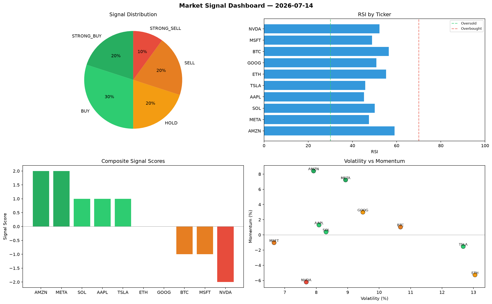

# Market Signal Report — 2026-07-14

**Run ID:** `9c194283d6` | **Buy:** 5 | **Sell:** 3 | **Hold:** 2

## Signal Dashboard

| Ticker | Price | Signal | Score | RSI | Momentum | Confidence |
|--------|-------|--------|-------|-----|----------|------------|
| AMZN | $5332.24 | **STRONG_BUY** | 2 | 59.05 | 0.0841 | 0.5 |
| META | $4766.87 | **STRONG_BUY** | 2 | 47.46 | 0.0723 | 0.5 |
| SOL | $3650.24 | **BUY** | 1 | 50.07 | 0.0038 | 0.25 |
| AAPL | $871.85 | **BUY** | 1 | 45.27 | 0.013 | 0.25 |
| TSLA | $297.13 | **BUY** | 1 | 45.81 | -0.0153 | 0.25 |
| ETH | $3719.43 | **HOLD** | 0 | 55.25 | -0.0527 | 0.0 |
| GOOG | $3975.2 | **HOLD** | 0 | 50.81 | 0.0299 | 0.0 |
| BTC | $1014.81 | **SELL** | -1 | 56.48 | 0.0103 | 0.25 |
| MSFT | $696.08 | **SELL** | -1 | 48.9 | -0.0103 | 0.25 |
| NVDA | $3226.18 | **STRONG_SELL** | -2 | 52.27 | -0.0621 | 0.5 |

## Delta vs Yesterday

| Ticker | Today | Yesterday | Price Change | Signal Changed |
|--------|-------|-----------|-------------|----------------|
| AMZN | STRONG_BUY | BUY | 📈 333.8% | ⚠️ YES |
| META | STRONG_BUY | HOLD | 📉 -2.39% | ⚠️ YES |
| SOL | BUY | STRONG_BUY | 📈 596.46% | ⚠️ YES |
| AAPL | BUY | STRONG_BUY | 📉 -57.72% | ⚠️ YES |
| TSLA | BUY | HOLD | 📉 -62.29% | ⚠️ YES |
| ETH | HOLD | SELL | 📈 994.66% | ⚠️ YES |
| GOOG | HOLD | HOLD | 📈 36.28% | — |
| BTC | SELL | HOLD | 📈 339.39% | ⚠️ YES |
| MSFT | SELL | STRONG_BUY | 📉 -50.01% | ⚠️ YES |
| NVDA | STRONG_SELL | HOLD | 📉 -26.45% | ⚠️ YES |