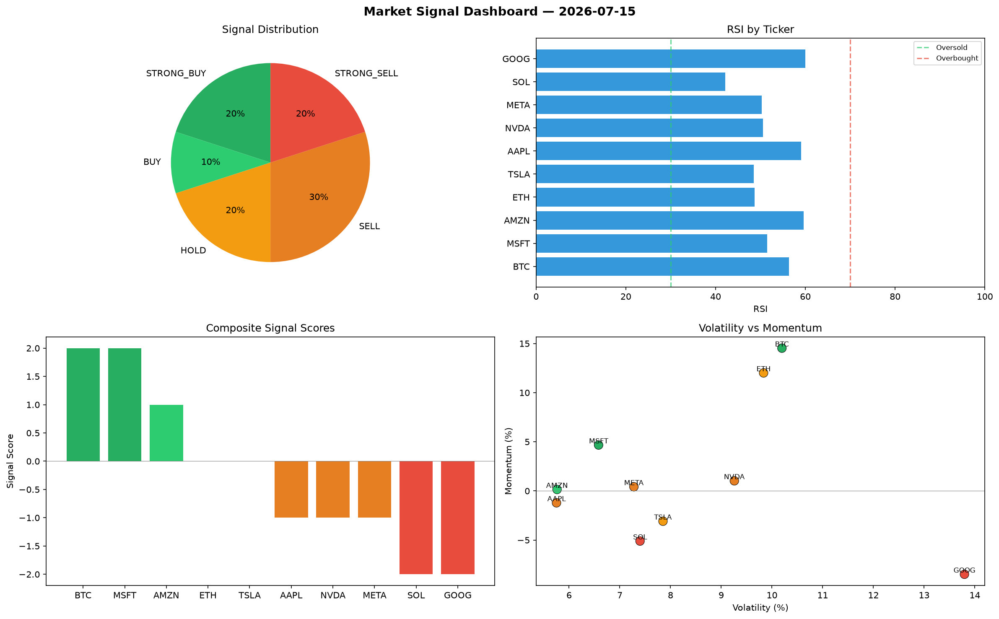

# Market Signal Report — 2026-07-15

**Run ID:** `df8deb1cd1` | **Buy:** 3 | **Sell:** 5 | **Hold:** 2

## Signal Dashboard

| Ticker | Price | Signal | Score | RSI | Momentum | Confidence |
|--------|-------|--------|-------|-----|----------|------------|
| BTC | $317.83 | **STRONG_BUY** | 2 | 56.31 | 0.1453 | 0.5 |
| MSFT | $776.91 | **STRONG_BUY** | 2 | 51.53 | 0.0467 | 0.5 |
| AMZN | $4277.31 | **BUY** | 1 | 59.64 | 0.0015 | 0.25 |
| ETH | $2406.58 | **HOLD** | 0 | 48.73 | 0.1201 | 0.0 |
| TSLA | $3346.05 | **HOLD** | 0 | 48.54 | -0.0308 | 0.0 |
| AAPL | $1863.5 | **SELL** | -1 | 59.02 | -0.0121 | 0.25 |
| NVDA | $240.11 | **SELL** | -1 | 50.55 | 0.0103 | 0.25 |
| META | $4637.88 | **SELL** | -1 | 50.24 | 0.0042 | 0.25 |
| SOL | $163.02 | **STRONG_SELL** | -2 | 42.17 | -0.051 | 0.5 |
| GOOG | $1249.32 | **STRONG_SELL** | -2 | 60.03 | -0.0848 | 0.5 |

## Delta vs Yesterday

| Ticker | Today | Yesterday | Price Change | Signal Changed |
|--------|-------|-----------|-------------|----------------|
| BTC | STRONG_BUY | STRONG_SELL | 📉 -82.6% | ⚠️ YES |
| MSFT | STRONG_BUY | HOLD | 📉 -70.33% | ⚠️ YES |
| AMZN | BUY | STRONG_SELL | 📈 35.43% | ⚠️ YES |
| ETH | HOLD | STRONG_BUY | 📈 117.96% | ⚠️ YES |
| TSLA | HOLD | STRONG_SELL | 📈 15.97% | ⚠️ YES |
| AAPL | SELL | STRONG_BUY | 📈 152.92% | ⚠️ YES |
| NVDA | SELL | STRONG_SELL | 📉 -93.87% | ⚠️ YES |
| META | SELL | HOLD | 📈 11.15% | ⚠️ YES |
| SOL | STRONG_SELL | STRONG_BUY | 📉 -96.12% | ⚠️ YES |
| GOOG | STRONG_SELL | HOLD | 📈 64.24% | ⚠️ YES |