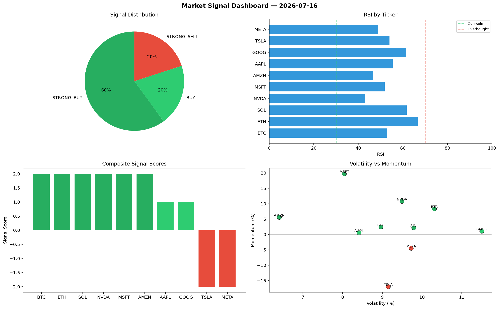

# Market Signal Report — 2026-07-16

**Run ID:** `f3bcf2af5f` | **Buy:** 8 | **Sell:** 2 | **Hold:** 0

## Signal Dashboard

| Ticker | Price | Signal | Score | RSI | Momentum | Confidence |
|--------|-------|--------|-------|-----|----------|------------|
| BTC | $3137.62 | **STRONG_BUY** | 2 | 53.04 | 0.0832 | 0.5 |
| ETH | $3302.47 | **STRONG_BUY** | 2 | 66.66 | 0.0241 | 0.5 |
| SOL | $295.26 | **STRONG_BUY** | 2 | 61.73 | 0.0216 | 0.5 |
| NVDA | $3152.81 | **STRONG_BUY** | 2 | 43.09 | 0.1077 | 0.5 |
| MSFT | $102.73 | **STRONG_BUY** | 2 | 51.83 | 0.1972 | 0.5 |
| AMZN | $1886.37 | **STRONG_BUY** | 2 | 46.68 | 0.0555 | 0.5 |
| AAPL | $3805.25 | **BUY** | 1 | 55.44 | 0.0057 | 0.25 |
| GOOG | $101.89 | **BUY** | 1 | 61.5 | 0.0105 | 0.25 |
| TSLA | $1562.92 | **STRONG_SELL** | -2 | 54.02 | -0.1697 | 0.5 |
| META | $447.35 | **STRONG_SELL** | -2 | 48.91 | -0.045 | 0.5 |

## Delta vs Yesterday

| Ticker | Today | Yesterday | Price Change | Signal Changed |
|--------|-------|-----------|-------------|----------------|
| BTC | STRONG_BUY | BUY | 📉 -37.86% | ⚠️ YES |
| ETH | STRONG_BUY | STRONG_SELL | 📈 25.47% | ⚠️ YES |
| SOL | STRONG_BUY | SELL | 📉 -89.94% | ⚠️ YES |
| NVDA | STRONG_BUY | STRONG_BUY | 📉 -19.59% | — |
| MSFT | STRONG_BUY | STRONG_SELL | 📉 -95.81% | ⚠️ YES |
| AMZN | STRONG_BUY | STRONG_SELL | 📉 -45.8% | ⚠️ YES |
| AAPL | BUY | STRONG_BUY | 📈 10.57% | ⚠️ YES |
| GOOG | BUY | STRONG_SELL | 📉 -92.69% | ⚠️ YES |
| TSLA | STRONG_SELL | STRONG_SELL | 📈 94.59% | — |
| META | STRONG_SELL | SELL | 📉 -74.89% | ⚠️ YES |