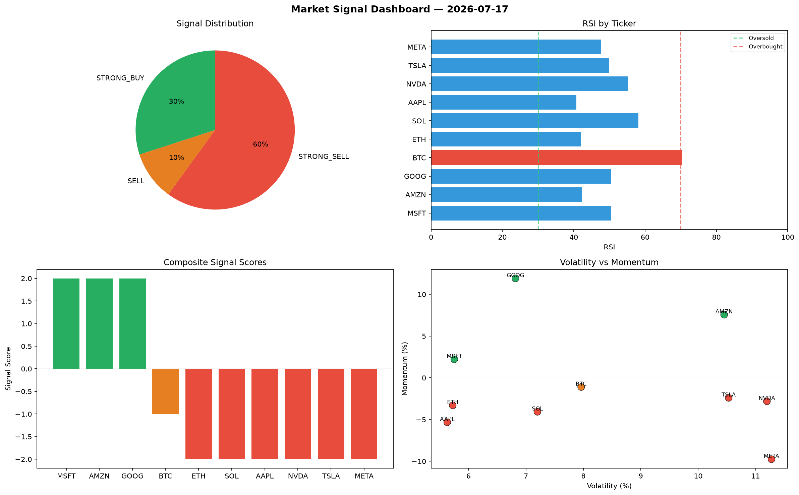

# Market Signal Report — 2026-07-17

**Run ID:** `8f12d6b86d` | **Buy:** 3 | **Sell:** 7 | **Hold:** 0

## Signal Dashboard

| Ticker | Price | Signal | Score | RSI | Momentum | Confidence |
|--------|-------|--------|-------|-----|----------|------------|
| MSFT | $2777.31 | **STRONG_BUY** | 2 | 50.43 | 0.0222 | 0.5 |
| AMZN | $2532.49 | **STRONG_BUY** | 2 | 42.32 | 0.0756 | 0.5 |
| GOOG | $3025.23 | **STRONG_BUY** | 2 | 50.42 | 0.1191 | 0.5 |
| BTC | $1319.0 | **SELL** | -1 | 70.37 | -0.011 | 0.25 |
| ETH | $3805.96 | **STRONG_SELL** | -2 | 42.01 | -0.033 | 0.5 |
| SOL | $2025.12 | **STRONG_SELL** | -2 | 58.14 | -0.0407 | 0.5 |
| AAPL | $1557.14 | **STRONG_SELL** | -2 | 40.72 | -0.0532 | 0.5 |
| NVDA | $85.52 | **STRONG_SELL** | -2 | 55.11 | -0.0281 | 0.5 |
| TSLA | $1084.23 | **STRONG_SELL** | -2 | 49.89 | -0.024 | 0.5 |
| META | $2745.65 | **STRONG_SELL** | -2 | 47.63 | -0.0975 | 0.5 |

## Delta vs Yesterday

| Ticker | Today | Yesterday | Price Change | Signal Changed |
|--------|-------|-----------|-------------|----------------|
| MSFT | STRONG_BUY | STRONG_BUY | 📈 2603.5% | — |
| AMZN | STRONG_BUY | STRONG_BUY | 📈 34.25% | — |
| GOOG | STRONG_BUY | BUY | 📈 2869.11% | ⚠️ YES |
| BTC | SELL | STRONG_BUY | 📉 -57.96% | ⚠️ YES |
| ETH | STRONG_SELL | STRONG_BUY | 📈 15.25% | ⚠️ YES |
| SOL | STRONG_SELL | STRONG_BUY | 📈 585.88% | ⚠️ YES |
| AAPL | STRONG_SELL | BUY | 📉 -59.08% | ⚠️ YES |
| NVDA | STRONG_SELL | STRONG_BUY | 📉 -97.29% | ⚠️ YES |
| TSLA | STRONG_SELL | STRONG_SELL | 📉 -30.63% | — |
| META | STRONG_SELL | STRONG_SELL | 📈 513.76% | — |