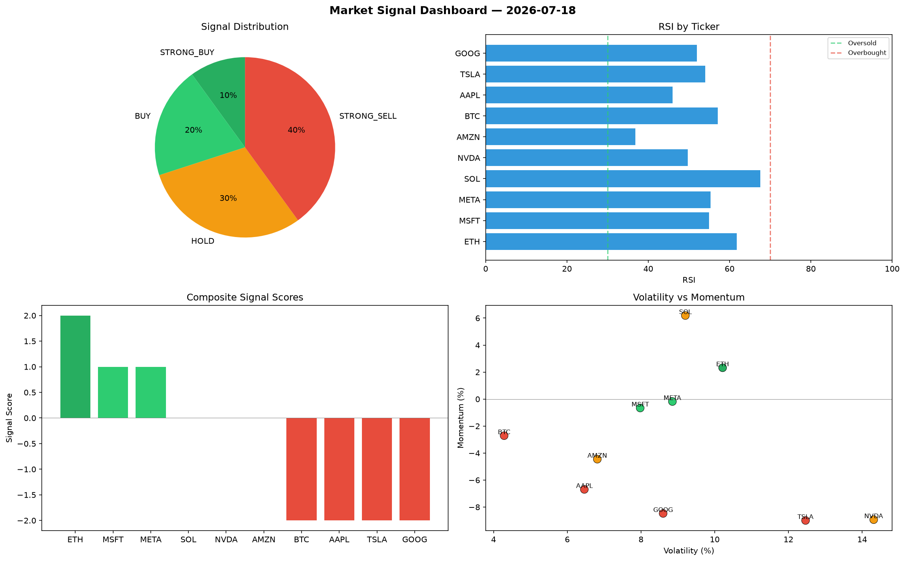

# Market Signal Report — 2026-07-18

**Run ID:** `e1ce32e262` | **Buy:** 3 | **Sell:** 4 | **Hold:** 3

## Signal Dashboard

| Ticker | Price | Signal | Score | RSI | Momentum | Confidence |
|--------|-------|--------|-------|-----|----------|------------|
| ETH | $1530.83 | **STRONG_BUY** | 2 | 61.73 | 0.0232 | 0.5 |
| MSFT | $2914.4 | **BUY** | 1 | 54.98 | -0.0066 | 0.25 |
| META | $3905.88 | **BUY** | 1 | 55.33 | -0.0018 | 0.25 |
| SOL | $428.26 | **HOLD** | 0 | 67.56 | 0.0619 | 0.0 |
| NVDA | $3446.55 | **HOLD** | 0 | 49.72 | -0.0893 | 0.0 |
| AMZN | $2067.4 | **HOLD** | 0 | 36.87 | -0.0445 | 0.0 |
| BTC | $2219.7 | **STRONG_SELL** | -2 | 57.13 | -0.0271 | 0.5 |
| AAPL | $4215.15 | **STRONG_SELL** | -2 | 46.0 | -0.0669 | 0.5 |
| TSLA | $657.45 | **STRONG_SELL** | -2 | 53.99 | -0.0899 | 0.5 |
| GOOG | $2911.44 | **STRONG_SELL** | -2 | 51.97 | -0.0847 | 0.5 |

## Delta vs Yesterday

| Ticker | Today | Yesterday | Price Change | Signal Changed |
|--------|-------|-----------|-------------|----------------|
| ETH | STRONG_BUY | STRONG_SELL | 📉 -58.21% | ⚠️ YES |
| MSFT | BUY | STRONG_BUY | 📈 278.07% | ⚠️ YES |
| META | BUY | STRONG_BUY | 📉 -26.12% | ⚠️ YES |
| SOL | HOLD | STRONG_SELL | 📉 -73.25% | ⚠️ YES |
| NVDA | HOLD | STRONG_SELL | 📈 250.4% | ⚠️ YES |
| AMZN | HOLD | STRONG_SELL | 📉 -39.94% | ⚠️ YES |
| BTC | STRONG_SELL | STRONG_BUY | 📈 1150.89% | ⚠️ YES |
| AAPL | STRONG_SELL | HOLD | 📈 1249.76% | ⚠️ YES |
| TSLA | STRONG_SELL | STRONG_BUY | 📉 -85.92% | ⚠️ YES |
| GOOG | STRONG_SELL | HOLD | 📉 -24.99% | ⚠️ YES |