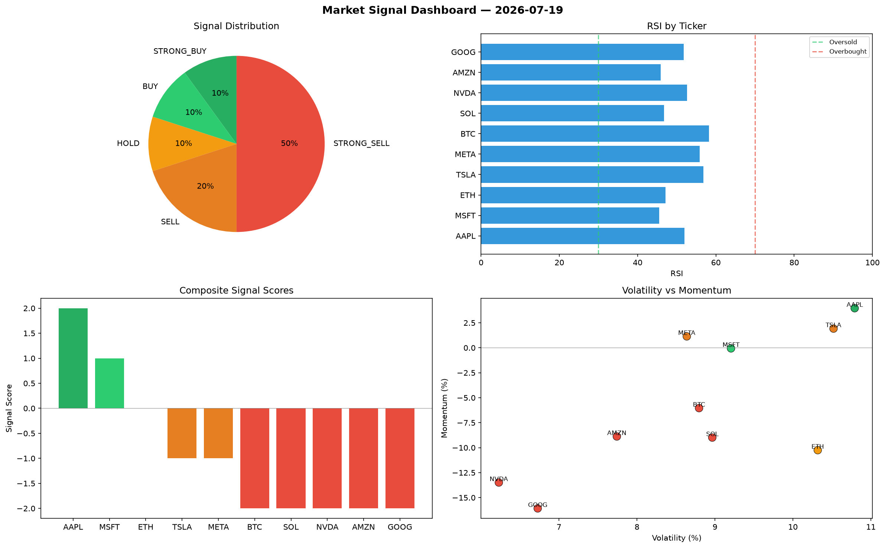

# Market Signal Report — 2026-07-19

**Run ID:** `c5b58bf5be` | **Buy:** 2 | **Sell:** 7 | **Hold:** 1

## Signal Dashboard

| Ticker | Price | Signal | Score | RSI | Momentum | Confidence |
|--------|-------|--------|-------|-----|----------|------------|
| AAPL | $368.42 | **STRONG_BUY** | 2 | 51.96 | 0.0396 | 0.5 |
| MSFT | $1405.17 | **BUY** | 1 | 45.49 | -0.0006 | 0.25 |
| ETH | $1197.65 | **HOLD** | 0 | 47.13 | -0.1025 | 0.0 |
| TSLA | $931.7 | **SELL** | -1 | 56.78 | 0.0192 | 0.25 |
| META | $38.25 | **SELL** | -1 | 55.86 | 0.0114 | 0.25 |
| BTC | $4080.68 | **STRONG_SELL** | -2 | 58.26 | -0.0604 | 0.5 |
| SOL | $3687.72 | **STRONG_SELL** | -2 | 46.75 | -0.0899 | 0.5 |
| NVDA | $1867.62 | **STRONG_SELL** | -2 | 52.61 | -0.1349 | 0.5 |
| AMZN | $4785.68 | **STRONG_SELL** | -2 | 45.88 | -0.0888 | 0.5 |
| GOOG | $2539.34 | **STRONG_SELL** | -2 | 51.75 | -0.1608 | 0.5 |

## Delta vs Yesterday

| Ticker | Today | Yesterday | Price Change | Signal Changed |
|--------|-------|-----------|-------------|----------------|
| AAPL | STRONG_BUY | STRONG_BUY | 📉 -85.09% | — |
| MSFT | BUY | HOLD | 📉 -39.37% | ⚠️ YES |
| ETH | HOLD | STRONG_SELL | 📈 2273.46% | ⚠️ YES |
| TSLA | SELL | HOLD | 📉 -79.12% | ⚠️ YES |
| META | SELL | SELL | 📉 -98.72% | — |
| BTC | STRONG_SELL | STRONG_SELL | 📉 -6.59% | — |
| SOL | STRONG_SELL | BUY | 📈 2271.07% | ⚠️ YES |
| NVDA | STRONG_SELL | HOLD | 📈 47.81% | ⚠️ YES |
| AMZN | STRONG_SELL | STRONG_SELL | 📈 172.46% | — |
| GOOG | STRONG_SELL | STRONG_BUY | 📉 -18.38% | ⚠️ YES |