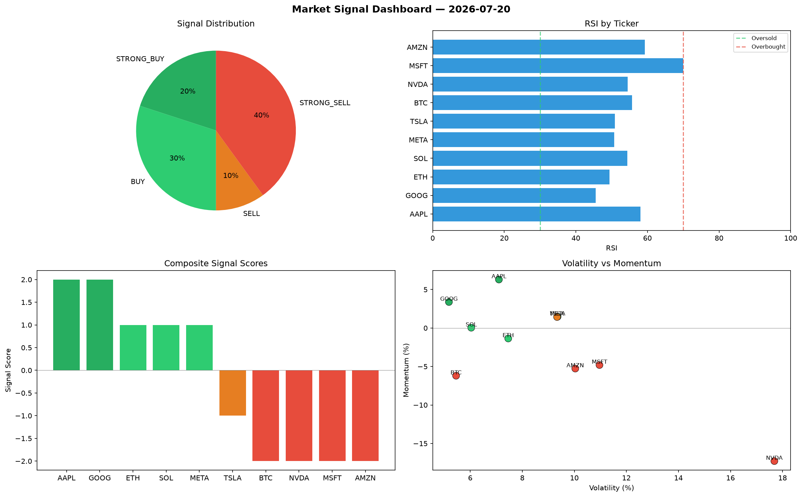

# Market Signal Report — 2026-07-20

**Run ID:** `e3eb111af7` | **Buy:** 5 | **Sell:** 5 | **Hold:** 0

## Signal Dashboard

| Ticker | Price | Signal | Score | RSI | Momentum | Confidence |
|--------|-------|--------|-------|-----|----------|------------|
| AAPL | $1715.16 | **STRONG_BUY** | 2 | 58.03 | 0.063 | 0.5 |
| GOOG | $4231.18 | **STRONG_BUY** | 2 | 45.59 | 0.0338 | 0.5 |
| ETH | $208.11 | **BUY** | 1 | 49.39 | -0.0136 | 0.25 |
| SOL | $3978.18 | **BUY** | 1 | 54.42 | 0.0004 | 0.25 |
| META | $769.4 | **BUY** | 1 | 50.75 | 0.0147 | 0.25 |
| TSLA | $433.61 | **SELL** | -1 | 50.89 | 0.0143 | 0.25 |
| BTC | $4143.87 | **STRONG_SELL** | -2 | 55.71 | -0.062 | 0.5 |
| NVDA | $3872.12 | **STRONG_SELL** | -2 | 54.45 | -0.1729 | 0.5 |
| MSFT | $1461.06 | **STRONG_SELL** | -2 | 69.94 | -0.0481 | 0.5 |
| AMZN | $1198.83 | **STRONG_SELL** | -2 | 59.26 | -0.0527 | 0.5 |

## Delta vs Yesterday

| Ticker | Today | Yesterday | Price Change | Signal Changed |
|--------|-------|-----------|-------------|----------------|
| AAPL | STRONG_BUY | HOLD | 📈 126.11% | ⚠️ YES |
| GOOG | STRONG_BUY | HOLD | 📈 239.81% | ⚠️ YES |
| ETH | BUY | HOLD | 📉 -94.27% | ⚠️ YES |
| SOL | BUY | STRONG_BUY | 📈 1033.42% | ⚠️ YES |
| META | BUY | STRONG_SELL | 📉 -65.67% | ⚠️ YES |
| TSLA | SELL | BUY | 📉 -84.88% | ⚠️ YES |
| BTC | STRONG_SELL | STRONG_SELL | 📈 89.68% | — |
| NVDA | STRONG_SELL | STRONG_SELL | 📉 -2.72% | — |
| MSFT | STRONG_SELL | STRONG_SELL | 📉 -66.66% | — |
| AMZN | STRONG_SELL | SELL | 📉 -11.38% | ⚠️ YES |