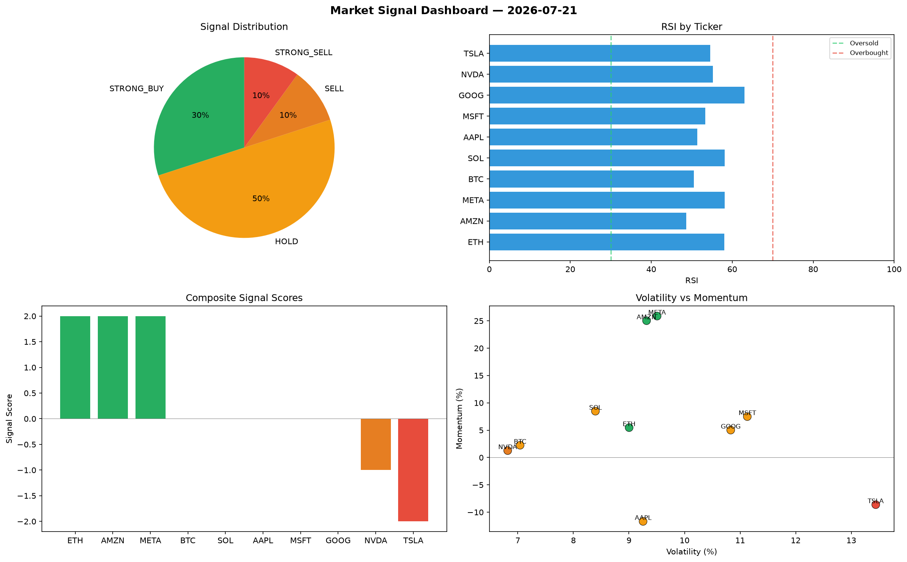

# Market Signal Report — 2026-07-21

**Run ID:** `ee29159b6a` | **Buy:** 3 | **Sell:** 2 | **Hold:** 5

## Signal Dashboard

| Ticker | Price | Signal | Score | RSI | Momentum | Confidence |
|--------|-------|--------|-------|-----|----------|------------|
| ETH | $2638.4 | **STRONG_BUY** | 2 | 58.06 | 0.0547 | 0.5 |
| AMZN | $2374.41 | **STRONG_BUY** | 2 | 48.65 | 0.2503 | 0.5 |
| META | $1835.83 | **STRONG_BUY** | 2 | 58.15 | 0.2587 | 0.5 |
| BTC | $2476.84 | **HOLD** | 0 | 50.51 | 0.0225 | 0.0 |
| SOL | $31.61 | **HOLD** | 0 | 58.16 | 0.0848 | 0.0 |
| AAPL | $3035.77 | **HOLD** | 0 | 51.34 | -0.1168 | 0.0 |
| MSFT | $2125.1 | **HOLD** | 0 | 53.36 | 0.0749 | 0.0 |
| GOOG | $2664.68 | **HOLD** | 0 | 63.04 | 0.0502 | 0.0 |
| NVDA | $2818.93 | **SELL** | -1 | 55.2 | 0.0127 | 0.25 |
| TSLA | $748.76 | **STRONG_SELL** | -2 | 54.54 | -0.0862 | 0.5 |

## Delta vs Yesterday

| Ticker | Today | Yesterday | Price Change | Signal Changed |
|--------|-------|-----------|-------------|----------------|
| ETH | STRONG_BUY | STRONG_SELL | 📈 3175.48% | ⚠️ YES |
| AMZN | STRONG_BUY | HOLD | 📈 98.6% | ⚠️ YES |
| META | STRONG_BUY | BUY | 📉 -28.1% | ⚠️ YES |
| BTC | HOLD | HOLD | 📈 237.23% | — |
| SOL | HOLD | SELL | 📉 -98.96% | ⚠️ YES |
| AAPL | HOLD | STRONG_BUY | 📈 55.59% | ⚠️ YES |
| MSFT | HOLD | HOLD | 📈 7.52% | — |
| GOOG | HOLD | BUY | 📈 197.29% | ⚠️ YES |
| NVDA | SELL | STRONG_BUY | 📈 1.13% | ⚠️ YES |
| TSLA | STRONG_SELL | BUY | 📉 -21.94% | ⚠️ YES |