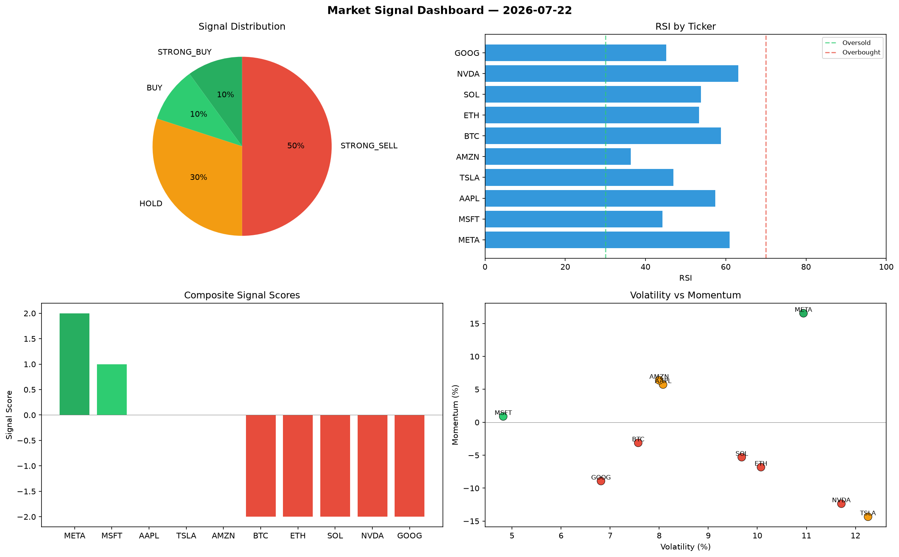

# Market Signal Report — 2026-07-22

**Run ID:** `1f14769839` | **Buy:** 2 | **Sell:** 5 | **Hold:** 3

## Signal Dashboard

| Ticker | Price | Signal | Score | RSI | Momentum | Confidence |
|--------|-------|--------|-------|-----|----------|------------|
| META | $1784.48 | **STRONG_BUY** | 2 | 60.94 | 0.1655 | 0.5 |
| MSFT | $20.4 | **BUY** | 1 | 44.19 | 0.0089 | 0.25 |
| AAPL | $3688.29 | **HOLD** | 0 | 57.41 | 0.0573 | 0.0 |
| TSLA | $1121.62 | **HOLD** | 0 | 47.0 | -0.1434 | 0.0 |
| AMZN | $4871.99 | **HOLD** | 0 | 36.35 | 0.0638 | 0.0 |
| BTC | $112.9 | **STRONG_SELL** | -2 | 58.83 | -0.0312 | 0.5 |
| ETH | $2984.22 | **STRONG_SELL** | -2 | 53.37 | -0.0681 | 0.5 |
| SOL | $4533.77 | **STRONG_SELL** | -2 | 53.83 | -0.053 | 0.5 |
| NVDA | $4113.82 | **STRONG_SELL** | -2 | 63.13 | -0.1236 | 0.5 |
| GOOG | $4613.29 | **STRONG_SELL** | -2 | 45.14 | -0.0892 | 0.5 |

## Delta vs Yesterday

| Ticker | Today | Yesterday | Price Change | Signal Changed |
|--------|-------|-----------|-------------|----------------|
| META | STRONG_BUY | STRONG_BUY | 📉 -2.8% | — |
| MSFT | BUY | HOLD | 📉 -99.04% | ⚠️ YES |
| AAPL | HOLD | HOLD | 📈 21.49% | — |
| TSLA | HOLD | STRONG_SELL | 📈 49.8% | ⚠️ YES |
| AMZN | HOLD | STRONG_BUY | 📈 105.19% | ⚠️ YES |
| BTC | STRONG_SELL | HOLD | 📉 -95.44% | ⚠️ YES |
| ETH | STRONG_SELL | STRONG_BUY | 📈 13.11% | ⚠️ YES |
| SOL | STRONG_SELL | HOLD | 📈 14242.83% | ⚠️ YES |
| NVDA | STRONG_SELL | SELL | 📈 45.94% | ⚠️ YES |
| GOOG | STRONG_SELL | HOLD | 📈 73.13% | ⚠️ YES |