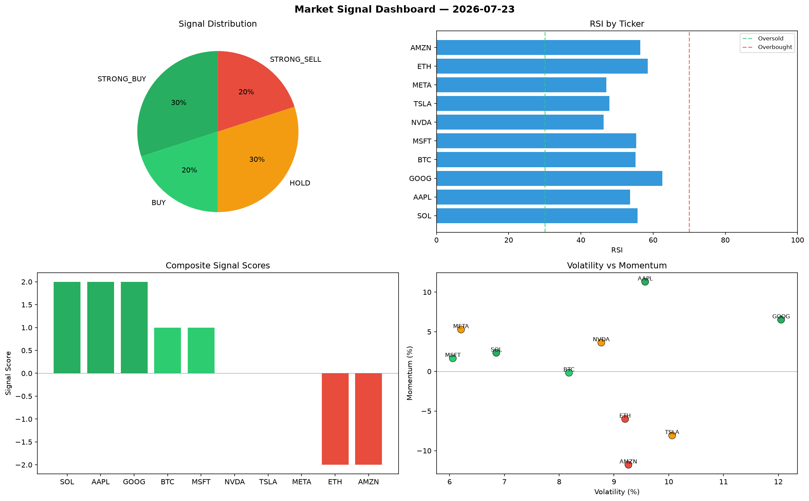

# Market Signal Report — 2026-07-23

**Run ID:** `3cb399486d` | **Buy:** 5 | **Sell:** 2 | **Hold:** 3

## Signal Dashboard

| Ticker | Price | Signal | Score | RSI | Momentum | Confidence |
|--------|-------|--------|-------|-----|----------|------------|
| SOL | $3310.3 | **STRONG_BUY** | 2 | 55.68 | 0.0234 | 0.5 |
| AAPL | $237.14 | **STRONG_BUY** | 2 | 53.67 | 0.113 | 0.5 |
| GOOG | $902.24 | **STRONG_BUY** | 2 | 62.6 | 0.0652 | 0.5 |
| BTC | $2434.65 | **BUY** | 1 | 55.15 | -0.0017 | 0.25 |
| MSFT | $580.83 | **BUY** | 1 | 55.28 | 0.0165 | 0.25 |
| NVDA | $4699.34 | **HOLD** | 0 | 46.29 | 0.0363 | 0.0 |
| TSLA | $476.48 | **HOLD** | 0 | 47.89 | -0.0808 | 0.0 |
| META | $13.17 | **HOLD** | 0 | 47.09 | 0.0528 | 0.0 |
| ETH | $3252.17 | **STRONG_SELL** | -2 | 58.5 | -0.06 | 0.5 |
| AMZN | $1163.9 | **STRONG_SELL** | -2 | 56.41 | -0.1178 | 0.5 |

## Delta vs Yesterday

| Ticker | Today | Yesterday | Price Change | Signal Changed |
|--------|-------|-----------|-------------|----------------|
| SOL | STRONG_BUY | HOLD | 📉 -23.15% | ⚠️ YES |
| AAPL | STRONG_BUY | HOLD | 📉 -21.0% | ⚠️ YES |
| GOOG | STRONG_BUY | STRONG_BUY | 📉 -77.75% | — |
| BTC | BUY | STRONG_BUY | 📉 -52.28% | ⚠️ YES |
| MSFT | BUY | STRONG_BUY | 📉 -46.33% | ⚠️ YES |
| NVDA | HOLD | HOLD | 📈 40.59% | — |
| TSLA | HOLD | HOLD | 📉 -55.0% | — |
| META | HOLD | STRONG_BUY | 📉 -99.25% | ⚠️ YES |
| ETH | STRONG_SELL | STRONG_SELL | 📈 156.35% | — |
| AMZN | STRONG_SELL | STRONG_BUY | 📈 2.04% | ⚠️ YES |