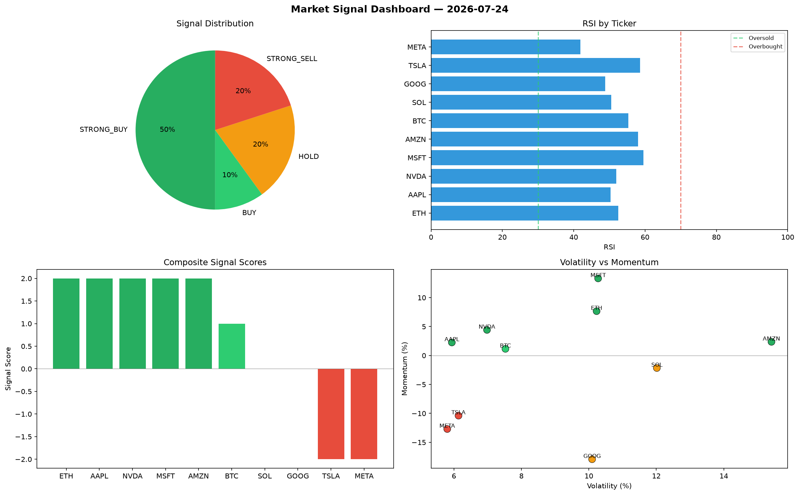

# Market Signal Report — 2026-07-24

**Run ID:** `2b2450d343` | **Buy:** 6 | **Sell:** 2 | **Hold:** 2

## Signal Dashboard

| Ticker | Price | Signal | Score | RSI | Momentum | Confidence |
|--------|-------|--------|-------|-----|----------|------------|
| ETH | $1199.36 | **STRONG_BUY** | 2 | 52.49 | 0.0766 | 0.5 |
| AAPL | $764.87 | **STRONG_BUY** | 2 | 50.37 | 0.0225 | 0.5 |
| NVDA | $2331.33 | **STRONG_BUY** | 2 | 51.89 | 0.0442 | 0.5 |
| MSFT | $2464.48 | **STRONG_BUY** | 2 | 59.53 | 0.1332 | 0.5 |
| AMZN | $257.8 | **STRONG_BUY** | 2 | 58.01 | 0.0236 | 0.5 |
| BTC | $940.08 | **BUY** | 1 | 55.28 | 0.0115 | 0.25 |
| SOL | $1937.34 | **HOLD** | 0 | 50.52 | -0.0216 | 0.0 |
| GOOG | $3114.41 | **HOLD** | 0 | 48.88 | -0.1792 | 0.0 |
| TSLA | $860.9 | **STRONG_SELL** | -2 | 58.62 | -0.1039 | 0.5 |
| META | $153.84 | **STRONG_SELL** | -2 | 41.85 | -0.127 | 0.5 |

## Delta vs Yesterday

| Ticker | Today | Yesterday | Price Change | Signal Changed |
|--------|-------|-----------|-------------|----------------|
| ETH | STRONG_BUY | SELL | 📈 47.29% | ⚠️ YES |
| AAPL | STRONG_BUY | STRONG_SELL | 📉 -81.74% | ⚠️ YES |
| NVDA | STRONG_BUY | STRONG_SELL | 📉 -36.78% | ⚠️ YES |
| MSFT | STRONG_BUY | STRONG_BUY | 📈 410.13% | — |
| AMZN | STRONG_BUY | STRONG_BUY | 📉 -86.0% | — |
| BTC | BUY | STRONG_BUY | 📉 -73.03% | ⚠️ YES |
| SOL | HOLD | STRONG_SELL | 📉 -51.99% | ⚠️ YES |
| GOOG | HOLD | HOLD | 📈 662.89% | — |
| TSLA | STRONG_SELL | HOLD | 📉 -77.23% | ⚠️ YES |
| META | STRONG_SELL | HOLD | 📉 -93.95% | ⚠️ YES |