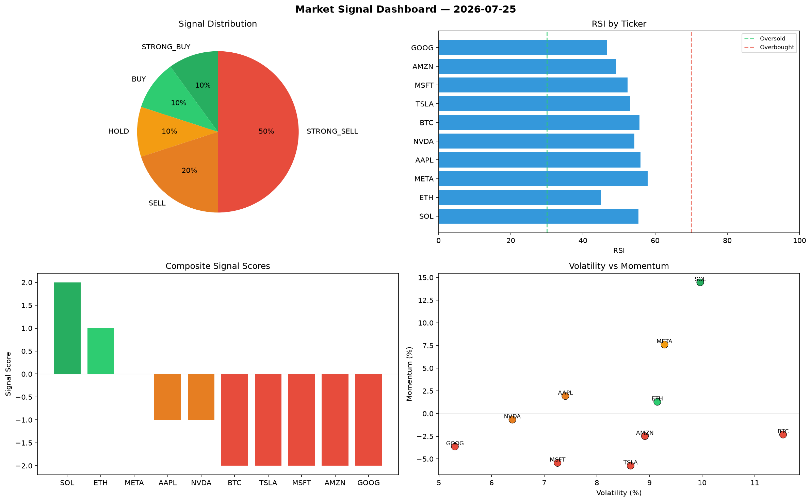

# Market Signal Report — 2026-07-25

**Run ID:** `6fb88e530d` | **Buy:** 2 | **Sell:** 7 | **Hold:** 1

## Signal Dashboard

| Ticker | Price | Signal | Score | RSI | Momentum | Confidence |
|--------|-------|--------|-------|-----|----------|------------|
| SOL | $2896.3 | **STRONG_BUY** | 2 | 55.42 | 0.1446 | 0.5 |
| ETH | $1599.16 | **BUY** | 1 | 45.05 | 0.0129 | 0.25 |
| META | $3552.12 | **HOLD** | 0 | 57.95 | 0.076 | 0.0 |
| AAPL | $4940.33 | **SELL** | -1 | 55.93 | 0.0193 | 0.25 |
| NVDA | $1072.92 | **SELL** | -1 | 54.25 | -0.0067 | 0.25 |
| BTC | $1213.59 | **STRONG_SELL** | -2 | 55.65 | -0.0232 | 0.5 |
| TSLA | $4541.16 | **STRONG_SELL** | -2 | 53.01 | -0.0575 | 0.5 |
| MSFT | $2583.16 | **STRONG_SELL** | -2 | 52.36 | -0.0544 | 0.5 |
| AMZN | $3167.56 | **STRONG_SELL** | -2 | 49.22 | -0.0249 | 0.5 |
| GOOG | $2096.85 | **STRONG_SELL** | -2 | 46.75 | -0.0364 | 0.5 |

## Delta vs Yesterday

| Ticker | Today | Yesterday | Price Change | Signal Changed |
|--------|-------|-----------|-------------|----------------|
| SOL | STRONG_BUY | STRONG_SELL | 📈 146.13% | ⚠️ YES |
| ETH | BUY | STRONG_SELL | 📉 -31.68% | ⚠️ YES |
| META | HOLD | HOLD | 📈 20.77% | — |
| AAPL | SELL | STRONG_SELL | 📈 1509.49% | ⚠️ YES |
| NVDA | SELL | STRONG_SELL | 📉 -67.11% | ⚠️ YES |
| BTC | STRONG_SELL | SELL | 📉 -61.55% | ⚠️ YES |
| TSLA | STRONG_SELL | HOLD | 📉 -0.41% | ⚠️ YES |
| MSFT | STRONG_SELL | STRONG_SELL | 📈 175.01% | — |
| AMZN | STRONG_SELL | HOLD | 📈 68.64% | ⚠️ YES |
| GOOG | STRONG_SELL | HOLD | 📉 -39.93% | ⚠️ YES |