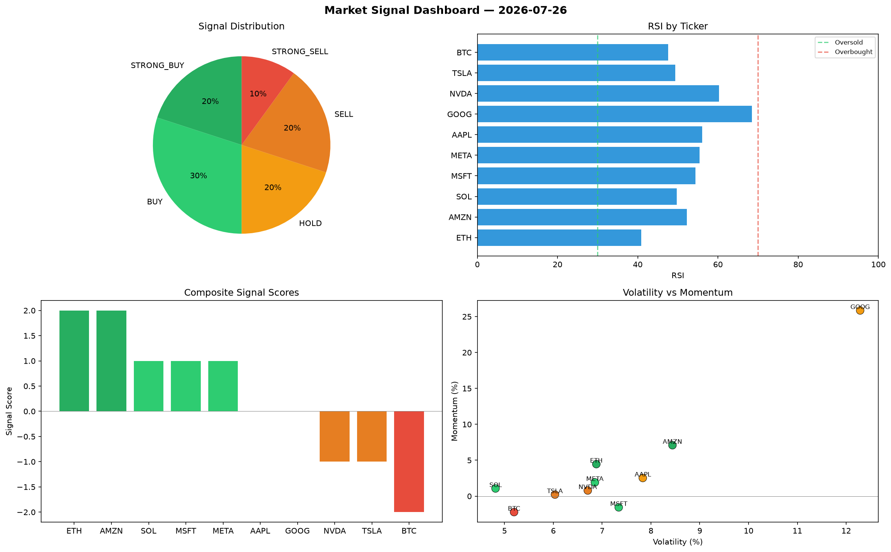

# Market Signal Report — 2026-07-26

**Run ID:** `28ef4d5174` | **Buy:** 5 | **Sell:** 3 | **Hold:** 2

## Signal Dashboard

| Ticker | Price | Signal | Score | RSI | Momentum | Confidence |
|--------|-------|--------|-------|-----|----------|------------|
| ETH | $2477.48 | **STRONG_BUY** | 2 | 40.85 | 0.0446 | 0.5 |
| AMZN | $3808.1 | **STRONG_BUY** | 2 | 52.28 | 0.0709 | 0.5 |
| SOL | $2410.54 | **BUY** | 1 | 49.71 | 0.0107 | 0.25 |
| MSFT | $410.12 | **BUY** | 1 | 54.37 | -0.0156 | 0.25 |
| META | $4005.12 | **BUY** | 1 | 55.42 | 0.0192 | 0.25 |
| AAPL | $4927.61 | **HOLD** | 0 | 56.08 | 0.0253 | 0.0 |
| GOOG | $3616.95 | **HOLD** | 0 | 68.51 | 0.2585 | 0.0 |
| NVDA | $2234.6 | **SELL** | -1 | 60.22 | 0.0079 | 0.25 |
| TSLA | $2861.59 | **SELL** | -1 | 49.38 | 0.0022 | 0.25 |
| BTC | $3153.16 | **STRONG_SELL** | -2 | 47.55 | -0.0222 | 0.5 |

## Delta vs Yesterday

| Ticker | Today | Yesterday | Price Change | Signal Changed |
|--------|-------|-----------|-------------|----------------|
| ETH | STRONG_BUY | HOLD | 📈 24.63% | ⚠️ YES |
| AMZN | STRONG_BUY | STRONG_SELL | 📈 13762.76% | ⚠️ YES |
| SOL | BUY | HOLD | 📈 1.01% | ⚠️ YES |
| MSFT | BUY | HOLD | 📉 -84.12% | ⚠️ YES |
| META | BUY | BUY | 📈 23.45% | — |
| AAPL | HOLD | HOLD | 📈 499.33% | — |
| GOOG | HOLD | STRONG_SELL | 📈 641.66% | ⚠️ YES |
| NVDA | SELL | SELL | 📈 3414.07% | — |
| TSLA | SELL | SELL | 📉 -2.99% | — |
| BTC | STRONG_SELL | SELL | 📈 204.84% | ⚠️ YES |