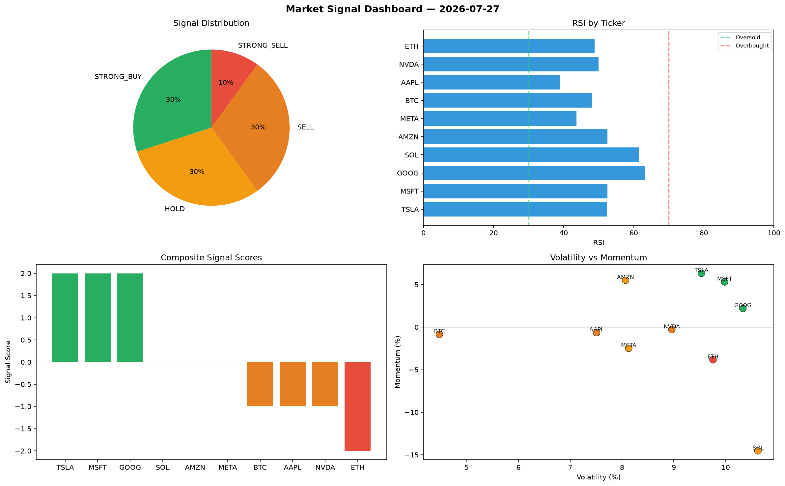

# Market Signal Report — 2026-07-27

**Run ID:** `d8e08552db` | **Buy:** 3 | **Sell:** 4 | **Hold:** 3

## Signal Dashboard

| Ticker | Price | Signal | Score | RSI | Momentum | Confidence |
|--------|-------|--------|-------|-----|----------|------------|
| TSLA | $3197.73 | **STRONG_BUY** | 2 | 52.39 | 0.0632 | 0.5 |
| MSFT | $186.5 | **STRONG_BUY** | 2 | 52.54 | 0.0531 | 0.5 |
| GOOG | $259.86 | **STRONG_BUY** | 2 | 63.29 | 0.0219 | 0.5 |
| SOL | $510.14 | **HOLD** | 0 | 61.51 | -0.1454 | 0.0 |
| AMZN | $1531.24 | **HOLD** | 0 | 52.5 | 0.055 | 0.0 |
| META | $3074.94 | **HOLD** | 0 | 43.64 | -0.0249 | 0.0 |
| BTC | $2851.19 | **SELL** | -1 | 48.08 | -0.0086 | 0.25 |
| AAPL | $2005.14 | **SELL** | -1 | 38.89 | -0.0065 | 0.25 |
| NVDA | $1364.76 | **SELL** | -1 | 49.94 | -0.003 | 0.25 |
| ETH | $3444.11 | **STRONG_SELL** | -2 | 48.88 | -0.0384 | 0.5 |

## Delta vs Yesterday

| Ticker | Today | Yesterday | Price Change | Signal Changed |
|--------|-------|-----------|-------------|----------------|
| TSLA | STRONG_BUY | STRONG_BUY | 📈 20.12% | — |
| MSFT | STRONG_BUY | STRONG_SELL | 📉 -93.37% | ⚠️ YES |
| GOOG | STRONG_BUY | SELL | 📉 -93.15% | ⚠️ YES |
| SOL | HOLD | BUY | 📉 -81.44% | ⚠️ YES |
| AMZN | HOLD | STRONG_SELL | 📉 -56.59% | ⚠️ YES |
| META | HOLD | STRONG_BUY | 📈 1562.22% | ⚠️ YES |
| BTC | SELL | SELL | 📈 83.96% | — |
| AAPL | SELL | SELL | 📉 -38.12% | — |
| NVDA | SELL | STRONG_SELL | 📈 72.02% | ⚠️ YES |
| ETH | STRONG_SELL | STRONG_BUY | 📉 -24.49% | ⚠️ YES |