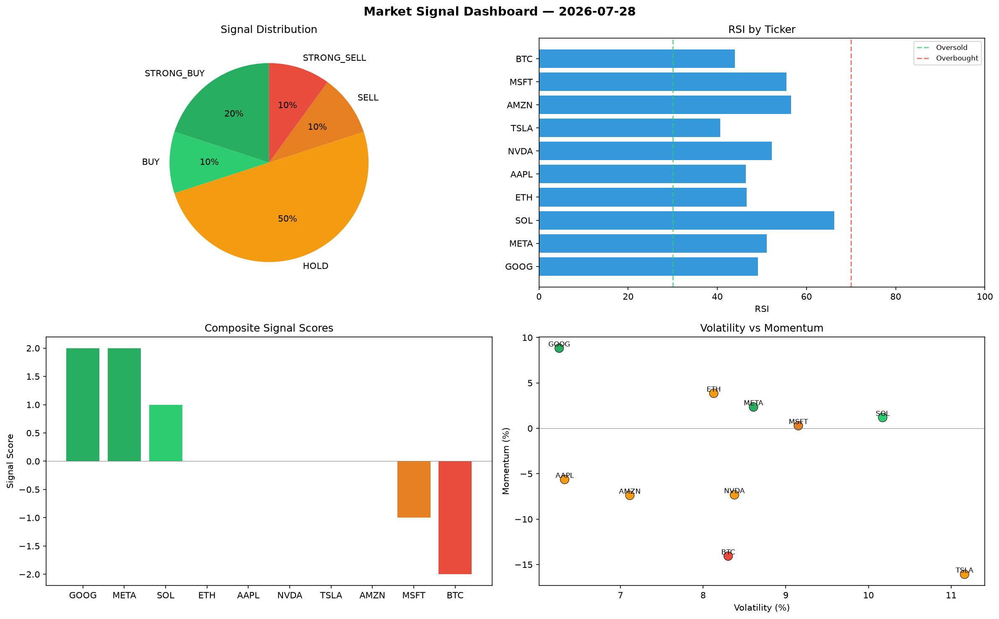

# Market Signal Report — 2026-07-28

**Run ID:** `e44449519f` | **Buy:** 3 | **Sell:** 2 | **Hold:** 5

## Signal Dashboard

| Ticker | Price | Signal | Score | RSI | Momentum | Confidence |
|--------|-------|--------|-------|-----|----------|------------|
| GOOG | $5258.42 | **STRONG_BUY** | 2 | 49.13 | 0.0883 | 0.5 |
| META | $2280.51 | **STRONG_BUY** | 2 | 51.12 | 0.0235 | 0.5 |
| SOL | $3197.47 | **BUY** | 1 | 66.2 | 0.0119 | 0.25 |
| ETH | $1720.11 | **HOLD** | 0 | 46.54 | 0.0386 | 0.0 |
| AAPL | $2449.24 | **HOLD** | 0 | 46.39 | -0.0563 | 0.0 |
| NVDA | $1657.18 | **HOLD** | 0 | 52.25 | -0.0732 | 0.0 |
| TSLA | $1836.52 | **HOLD** | 0 | 40.61 | -0.1607 | 0.0 |
| AMZN | $273.14 | **HOLD** | 0 | 56.59 | -0.0738 | 0.0 |
| MSFT | $2903.95 | **SELL** | -1 | 55.54 | 0.0029 | 0.25 |
| BTC | $2409.37 | **STRONG_SELL** | -2 | 43.97 | -0.1407 | 0.5 |

## Delta vs Yesterday

| Ticker | Today | Yesterday | Price Change | Signal Changed |
|--------|-------|-----------|-------------|----------------|
| GOOG | STRONG_BUY | STRONG_BUY | 📈 1923.56% | — |
| META | STRONG_BUY | HOLD | 📉 -25.84% | ⚠️ YES |
| SOL | BUY | HOLD | 📈 526.78% | ⚠️ YES |
| ETH | HOLD | STRONG_SELL | 📉 -50.06% | ⚠️ YES |
| AAPL | HOLD | SELL | 📈 22.15% | ⚠️ YES |
| NVDA | HOLD | SELL | 📈 21.43% | ⚠️ YES |
| TSLA | HOLD | STRONG_BUY | 📉 -42.57% | ⚠️ YES |
| AMZN | HOLD | HOLD | 📉 -82.16% | — |
| MSFT | SELL | STRONG_BUY | 📈 1457.08% | ⚠️ YES |
| BTC | STRONG_SELL | SELL | 📉 -15.5% | ⚠️ YES |