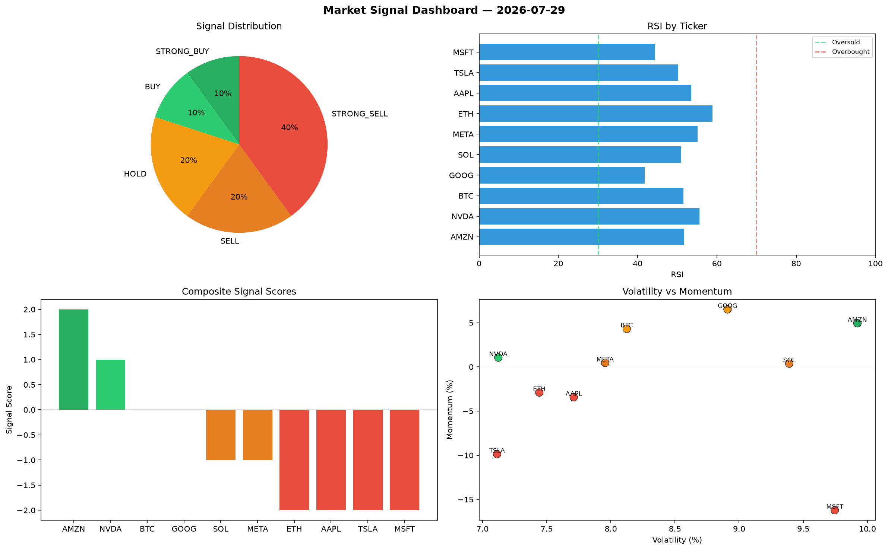

# Market Signal Report — 2026-07-29

**Run ID:** `843c8c6505` | **Buy:** 2 | **Sell:** 6 | **Hold:** 2

## Signal Dashboard

| Ticker | Price | Signal | Score | RSI | Momentum | Confidence |
|--------|-------|--------|-------|-----|----------|------------|
| AMZN | $416.53 | **STRONG_BUY** | 2 | 51.71 | 0.0493 | 0.5 |
| NVDA | $3095.83 | **BUY** | 1 | 55.61 | 0.0106 | 0.25 |
| BTC | $1679.36 | **HOLD** | 0 | 51.52 | 0.043 | 0.0 |
| GOOG | $3085.04 | **HOLD** | 0 | 41.8 | 0.0651 | 0.0 |
| SOL | $49.23 | **SELL** | -1 | 50.94 | 0.0037 | 0.25 |
| META | $4251.24 | **SELL** | -1 | 55.14 | 0.0045 | 0.25 |
| ETH | $2367.4 | **STRONG_SELL** | -2 | 58.86 | -0.029 | 0.5 |
| AAPL | $484.28 | **STRONG_SELL** | -2 | 53.5 | -0.0343 | 0.5 |
| TSLA | $3409.26 | **STRONG_SELL** | -2 | 50.25 | -0.0987 | 0.5 |
| MSFT | $2532.12 | **STRONG_SELL** | -2 | 44.4 | -0.1622 | 0.5 |

## Delta vs Yesterday

| Ticker | Today | Yesterday | Price Change | Signal Changed |
|--------|-------|-----------|-------------|----------------|
| AMZN | STRONG_BUY | HOLD | 📈 52.5% | ⚠️ YES |
| NVDA | BUY | HOLD | 📈 86.81% | ⚠️ YES |
| BTC | HOLD | STRONG_SELL | 📉 -30.3% | ⚠️ YES |
| GOOG | HOLD | STRONG_BUY | 📉 -41.33% | ⚠️ YES |
| SOL | SELL | BUY | 📉 -98.46% | ⚠️ YES |
| META | SELL | STRONG_BUY | 📈 86.42% | ⚠️ YES |
| ETH | STRONG_SELL | HOLD | 📈 37.63% | ⚠️ YES |
| AAPL | STRONG_SELL | HOLD | 📉 -80.23% | ⚠️ YES |
| TSLA | STRONG_SELL | HOLD | 📈 85.64% | ⚠️ YES |
| MSFT | STRONG_SELL | SELL | 📉 -12.8% | ⚠️ YES |