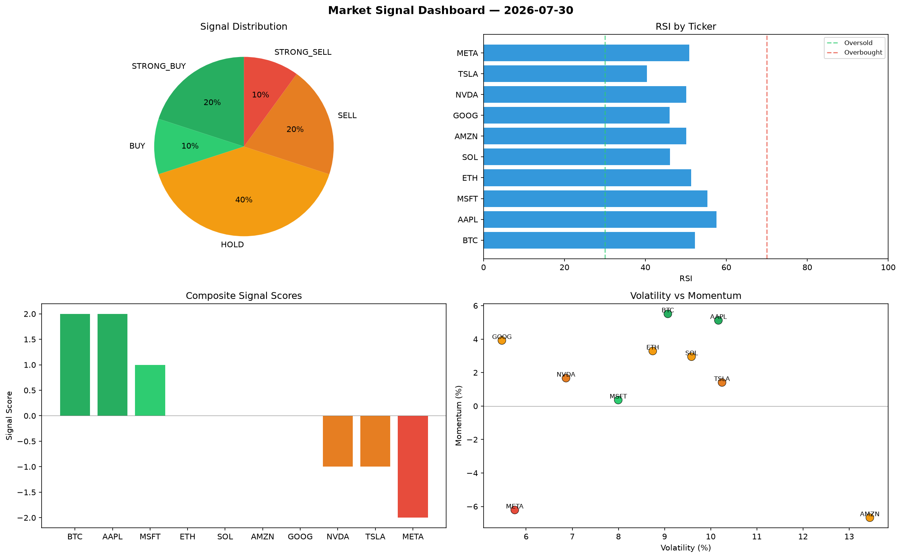

# Market Signal Report — 2026-07-30

**Run ID:** `8877eef306` | **Buy:** 3 | **Sell:** 3 | **Hold:** 4

## Signal Dashboard

| Ticker | Price | Signal | Score | RSI | Momentum | Confidence |
|--------|-------|--------|-------|-----|----------|------------|
| BTC | $4238.25 | **STRONG_BUY** | 2 | 52.21 | 0.0551 | 0.5 |
| AAPL | $4884.15 | **STRONG_BUY** | 2 | 57.6 | 0.0512 | 0.5 |
| MSFT | $4420.19 | **BUY** | 1 | 55.31 | 0.0036 | 0.25 |
| ETH | $2555.64 | **HOLD** | 0 | 51.33 | 0.0329 | 0.0 |
| SOL | $2046.27 | **HOLD** | 0 | 46.09 | 0.0295 | 0.0 |
| AMZN | $1729.43 | **HOLD** | 0 | 50.07 | -0.0667 | 0.0 |
| GOOG | $470.3 | **HOLD** | 0 | 46.01 | 0.0392 | 0.0 |
| NVDA | $4390.25 | **SELL** | -1 | 50.12 | 0.0167 | 0.25 |
| TSLA | $2492.58 | **SELL** | -1 | 40.42 | 0.0141 | 0.25 |
| META | $2415.47 | **STRONG_SELL** | -2 | 50.81 | -0.0621 | 0.5 |

## Delta vs Yesterday

| Ticker | Today | Yesterday | Price Change | Signal Changed |
|--------|-------|-----------|-------------|----------------|
| BTC | STRONG_BUY | STRONG_SELL | 📈 27.83% | ⚠️ YES |
| AAPL | STRONG_BUY | HOLD | 📉 -2.94% | ⚠️ YES |
| MSFT | BUY | BUY | 📉 -1.99% | — |
| ETH | HOLD | STRONG_SELL | 📈 332.69% | ⚠️ YES |
| SOL | HOLD | HOLD | 📈 70.31% | — |
| AMZN | HOLD | STRONG_SELL | 📉 -28.08% | ⚠️ YES |
| GOOG | HOLD | HOLD | 📉 -88.53% | — |
| NVDA | SELL | STRONG_BUY | 📉 -11.79% | ⚠️ YES |
| TSLA | SELL | SELL | 📈 10.09% | — |
| META | STRONG_SELL | SELL | 📈 7.13% | ⚠️ YES |