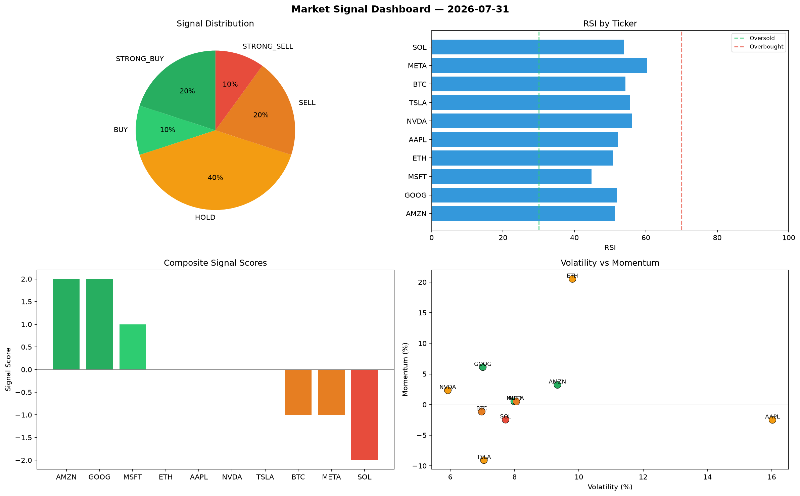

# Market Signal Report — 2026-07-31

**Run ID:** `484759b9a1` | **Buy:** 3 | **Sell:** 3 | **Hold:** 4

## Signal Dashboard

| Ticker | Price | Signal | Score | RSI | Momentum | Confidence |
|--------|-------|--------|-------|-----|----------|------------|
| AMZN | $2392.08 | **STRONG_BUY** | 2 | 51.29 | 0.0321 | 0.5 |
| GOOG | $428.45 | **STRONG_BUY** | 2 | 51.98 | 0.0611 | 0.5 |
| MSFT | $4206.85 | **BUY** | 1 | 44.8 | 0.0053 | 0.25 |
| ETH | $4482.68 | **HOLD** | 0 | 50.69 | 0.2051 | 0.0 |
| AAPL | $4639.88 | **HOLD** | 0 | 52.16 | -0.0251 | 0.0 |
| NVDA | $4440.43 | **HOLD** | 0 | 56.15 | 0.0233 | 0.0 |
| TSLA | $2515.92 | **HOLD** | 0 | 55.57 | -0.0908 | 0.0 |
| BTC | $3683.93 | **SELL** | -1 | 54.25 | -0.0116 | 0.25 |
| META | $4805.81 | **SELL** | -1 | 60.37 | 0.0049 | 0.25 |
| SOL | $191.24 | **STRONG_SELL** | -2 | 53.87 | -0.0247 | 0.5 |

## Delta vs Yesterday

| Ticker | Today | Yesterday | Price Change | Signal Changed |
|--------|-------|-----------|-------------|----------------|
| AMZN | STRONG_BUY | STRONG_SELL | 📈 50.51% | ⚠️ YES |
| GOOG | STRONG_BUY | SELL | 📉 -80.55% | ⚠️ YES |
| MSFT | BUY | STRONG_BUY | 📈 139.56% | ⚠️ YES |
| ETH | HOLD | SELL | 📈 406.49% | ⚠️ YES |
| AAPL | HOLD | BUY | 📈 134.92% | ⚠️ YES |
| NVDA | HOLD | HOLD | 📈 90.57% | — |
| TSLA | HOLD | STRONG_BUY | 📈 68.59% | ⚠️ YES |
| BTC | SELL | BUY | 📈 17.8% | ⚠️ YES |
| META | SELL | STRONG_SELL | 📈 433.58% | ⚠️ YES |
| SOL | STRONG_SELL | SELL | 📉 -95.41% | ⚠️ YES |