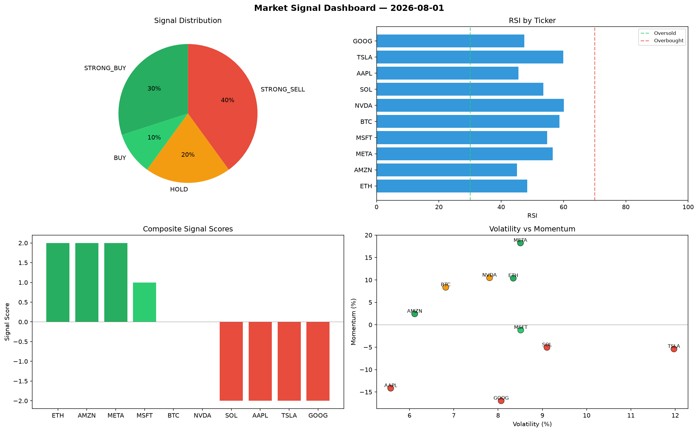

# Market Signal Report — 2026-08-01

**Run ID:** `91b904b8c8` | **Buy:** 4 | **Sell:** 4 | **Hold:** 2

## Signal Dashboard

| Ticker | Price | Signal | Score | RSI | Momentum | Confidence |
|--------|-------|--------|-------|-----|----------|------------|
| ETH | $4220.45 | **STRONG_BUY** | 2 | 48.39 | 0.1038 | 0.5 |
| AMZN | $731.89 | **STRONG_BUY** | 2 | 45.05 | 0.0243 | 0.5 |
| META | $4487.19 | **STRONG_BUY** | 2 | 56.59 | 0.1824 | 0.5 |
| MSFT | $1087.32 | **BUY** | 1 | 54.8 | -0.0118 | 0.25 |
| BTC | $2754.54 | **HOLD** | 0 | 58.67 | 0.0835 | 0.0 |
| NVDA | $3895.0 | **HOLD** | 0 | 60.12 | 0.1048 | 0.0 |
| SOL | $3209.59 | **STRONG_SELL** | -2 | 53.57 | -0.0505 | 0.5 |
| AAPL | $3622.29 | **STRONG_SELL** | -2 | 45.53 | -0.1416 | 0.5 |
| TSLA | $2485.21 | **STRONG_SELL** | -2 | 59.91 | -0.054 | 0.5 |
| GOOG | $2858.47 | **STRONG_SELL** | -2 | 47.47 | -0.1696 | 0.5 |

## Delta vs Yesterday

| Ticker | Today | Yesterday | Price Change | Signal Changed |
|--------|-------|-----------|-------------|----------------|
| ETH | STRONG_BUY | SELL | 📈 811.96% | ⚠️ YES |
| AMZN | STRONG_BUY | STRONG_BUY | 📉 -82.69% | — |
| META | STRONG_BUY | STRONG_SELL | 📈 53.99% | ⚠️ YES |
| MSFT | BUY | BUY | 📉 -23.22% | — |
| BTC | HOLD | STRONG_BUY | 📈 537.67% | ⚠️ YES |
| NVDA | HOLD | STRONG_SELL | 📈 3.41% | ⚠️ YES |
| SOL | STRONG_SELL | BUY | 📉 -1.01% | ⚠️ YES |
| AAPL | STRONG_SELL | STRONG_BUY | 📈 49.13% | ⚠️ YES |
| TSLA | STRONG_SELL | STRONG_BUY | 📉 -19.58% | ⚠️ YES |
| GOOG | STRONG_SELL | STRONG_BUY | 📉 -35.82% | ⚠️ YES |