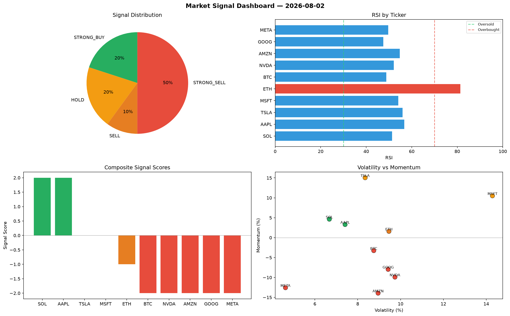

# Market Signal Report — 2026-08-02

**Run ID:** `695a87ea4e` | **Buy:** 2 | **Sell:** 6 | **Hold:** 2

## Signal Dashboard

| Ticker | Price | Signal | Score | RSI | Momentum | Confidence |
|--------|-------|--------|-------|-----|----------|------------|
| SOL | $3989.84 | **STRONG_BUY** | 2 | 51.38 | 0.0463 | 0.5 |
| AAPL | $4257.17 | **STRONG_BUY** | 2 | 56.75 | 0.0329 | 0.5 |
| TSLA | $4011.5 | **HOLD** | 0 | 56.01 | 0.1504 | 0.0 |
| MSFT | $4895.92 | **HOLD** | 0 | 54.07 | 0.105 | 0.0 |
| ETH | $589.36 | **SELL** | -1 | 81.35 | 0.0158 | 0.25 |
| BTC | $4548.61 | **STRONG_SELL** | -2 | 48.79 | -0.0326 | 0.5 |
| NVDA | $423.32 | **STRONG_SELL** | -2 | 52.16 | -0.0991 | 0.5 |
| AMZN | $1302.72 | **STRONG_SELL** | -2 | 54.75 | -0.1394 | 0.5 |
| GOOG | $3115.35 | **STRONG_SELL** | -2 | 47.5 | -0.0796 | 0.5 |
| META | $1941.1 | **STRONG_SELL** | -2 | 49.67 | -0.1257 | 0.5 |

## Delta vs Yesterday

| Ticker | Today | Yesterday | Price Change | Signal Changed |
|--------|-------|-----------|-------------|----------------|
| SOL | STRONG_BUY | HOLD | 📈 12.55% | ⚠️ YES |
| AAPL | STRONG_BUY | STRONG_BUY | 📈 532.29% | — |
| TSLA | HOLD | SELL | 📈 68.52% | ⚠️ YES |
| MSFT | HOLD | HOLD | 📈 121.27% | — |
| ETH | SELL | STRONG_BUY | 📉 -87.99% | ⚠️ YES |
| BTC | STRONG_SELL | STRONG_SELL | 📈 3330.07% | — |
| NVDA | STRONG_SELL | STRONG_BUY | 📉 -48.57% | ⚠️ YES |
| AMZN | STRONG_SELL | BUY | 📈 41.84% | ⚠️ YES |
| GOOG | STRONG_SELL | STRONG_BUY | 📈 105.84% | ⚠️ YES |
| META | STRONG_SELL | HOLD | 📉 -59.24% | ⚠️ YES |